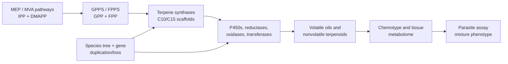

# Terpene diversity, biosynthetic evolution, and antiparasitic evidence across *Artemisia* species

## Abstract

The genus *Artemisia* contains a chemically diverse collection of volatile terpenes, nonvolatile terpenoids, and sesquiterpene lactones. This review develops a source-backed framework for comparing that chemistry across species while avoiding a common error: treating an essential-oil profile, a pathway gene, or an in-vitro parasite assay as a genus-wide pharmacological conclusion. We synthesize monoterpenes, sesquiterpenes, diterpenes, triterpenes, and sesquiterpene lactones; evaluate biosynthetic compartmentalization and gene-family evolution; and connect candidate pathway changes to chemotype and antiparasitic evidence. The best-resolved pathway is artemisinin biosynthesis in *A. annua*, but recent *A. argyi* results illustrate why gene presence/absence claims require assembly- and annotation-aware reconciliation. Essential-oil activity against *Leishmania* provides phenotype anchors, yet constituent attribution remains unresolved in mixture studies. We propose a reproducible, phylogeny-aware research program combining voucher-linked metabolomics, secretory-tissue transcriptomics, comparative genomics, enzyme assays, and fractionated parasite testing.

**Keywords:** *Artemisia*; terpenes; sesquiterpene lactones; artemisinin; chemotype; comparative genomics; essential oil; antiparasitic activity

## 1. Introduction

*Artemisia* is a large genus with substantial ecological, morphological, ploidy, and phytochemical diversity. Its volatile chemistry is concentrated especially in leaves and flowers, but reported profiles vary with genotype, chemotype, locality, tissue, ontogeny, harvest, drying, and extraction. Consequently, “the terpene profile of *Artemisia*” is not a single biological object; the appropriate unit of comparison is a documented specimen or accession with analytical context.

This review has two aims. First, it organizes the major terpene classes reported from *Artemisia* and summarizes the biosynthetic logic connecting precursor supply, synthase diversification, oxidation, lactonization, storage, and regulation. Second, it evaluates whether comparative evolutionary genomics can connect that diversity to antiparasitic phenotypes without overstating causality.

The evidence extraction unit is a specimen, accession, or explicitly bounded experimental preparation. Representative records are provided in `chemotype-table.csv`; they are not species means. The review follows the protocol in `review-protocol.md` and the source identifiers in `sources.json`.

### 1.1 What previous reviews establish—and what remains open

Yes, *Artemisia* terpene and terpenoid reviews have been published. The principal precedents include a genus-level essential-oil review, a 2012–2017 essential-oil update, a dedicated sesquiterpene-lactone analysis and methods review, a review of edible species and selected sesquiterpene lactones, and a 2024 genus-wide phytochemistry, pharmacology, and toxicology review ([Abad et al. 2012](https://pmc.ncbi.nlm.nih.gov/articles/PMC6268508/); [Pandey and Singh 2017](https://pubmed.ncbi.nlm.nih.gov/28930281/); [Ivanescu et al. 2015](https://pmc.ncbi.nlm.nih.gov/articles/PMC4606394/); [Trendafilova et al. 2021](https://pubmed.ncbi.nlm.nih.gov/33396790/); [Hussain et al. 2024](https://pubmed.ncbi.nlm.nih.gov/37711006/)). These reviews establish the breadth of reported chemistry and biological claims, but they generally do not provide one specimen-level, class-balanced, phylogeny-aware evidence model connecting terpene chemistry, evolutionary genomics, tissue context, antiparasitic stage, and safety. The present package is designed as an auditable update and integration, not as a claim that prior reviews were absent or noncomprehensive.

## 2. Chemical scope and terminology

Terpenes are assembled from C5 isoprenoid units. Monoterpenes are principally C10, sesquiterpenes C15, diterpenes C20, and triterpenes C30; oxygenated and rearranged products are more precisely terpenoids. Sesquiterpene lactones are C15 terpenoids containing a lactone ring and are generally treated as extractable specialized metabolites rather than ordinary essential-oil constituents.

Representative volatile classes include pinene, limonene, myrcene, camphor, 1,8-cineole, borneol, thujones, germacrene D, β-caryophyllene, α-humulene, davanone, spathulenol, and caryophyllene oxide. Important nonvolatile or less volatile chemistry includes artemisinin and related compounds, guaianolide and germacranolide sesquiterpene lactones, and triterpenoids associated with plant surfaces and defense.

### 2.1 Evidence map by class

| Class | Representative *Artemisia* chemistry | Main analytical context | Review interpretation |
|---|---|---|---|
| Monoterpenes and oxygenated monoterpenes | α-/β-pinene, limonene, myrcene, camphor, 1,8-cineole, borneol, thujones, artemisia ketone | GC-MS/GC-FID of volatile oils and headspace fractions | Often abundant, but highly sensitive to chemotype, tissue, stage, drying, and distillation |
| Sesquiterpene hydrocarbons and oxygenated sesquiterpenes | germacrene D, β-caryophyllene, α-humulene, davanone, spathulenol, caryophyllene oxide | GC-MS of oils; targeted volatile profiling | Useful markers of population chemistry, not universal species signatures |
| Sesquiterpene lactones | artemisinin, arteannuin B, artemisinic acid, santonin, guaianolides, germacranolides, absinthin-related compounds | LC-MS/HPLC, NMR, isolation; GC is often unsuitable without derivatization | Usually nonvolatile; structural and stereochemical confirmation is critical |
| Diterpenes | species-specific diterpenoid constituents and chlorophyll-associated phytol derivatives | Solvent extraction, LC-MS, NMR; often reported in broad phytochemical surveys | Less comprehensively sampled than C10/C15 chemistry; presence should be linked to isolation or validated MS evidence |
| Triterpenes and sterols | β-amyrin/α-amyrin-, friedelin-, cycloartane- and sterol-associated reports | Solvent extraction, LC-MS, GC-MS after derivatization, NMR | Surface and storage chemistry; not part of ordinary essential-oil comparisons |

The unevenness of this evidence map is itself a result: volatile mono- and sesquiterpenes are overrepresented because they are accessible to routine GC analysis, whereas nonvolatile diterpenes, triterpenes, and lactones require extraction workflows that are less directly comparable across studies.

Primary studies show that the under-sampled classes are not merely theoretical. In *A. annua*, seed isolation recovered fourteen sesquiterpenes, three monoterpenes, and one diterpene ([Brown et al. 2003](https://pubmed.ncbi.nlm.nih.gov/12946429/)). Separate trichome transcriptome and heterologous-expression work functionally characterized the oxidosqualene cyclase OSC2 and P450 CYP716A14v2 in aerial-cuticle triterpenoid production ([Moses et al. 2015](https://pubmed.ncbi.nlm.nih.gov/25576188/)), while a diterpene-synthase study identified ten *A. annua* diTPS genes in a glandular-trichome and stress-resilience context ([Chen et al. 2021](https://pubmed.ncbi.nlm.nih.gov/33740256/)). These are class-specific anchors, not evidence that all *Artemisia* species share the same diterpene or triterpene repertoire.

### 2.2 Monoterpenes and volatile sesquiterpenes

Monoterpenes are the most method-accessible *Artemisia* terpenoids. Across oils, recurrent chemistries include pinene and limonene hydrocarbons, camphor, borneol, 1,8-cineole, thujones, and irregular-monoterpene products such as artemisia ketone. Volatile sesquiterpenes add germacrene D, β-caryophyllene, α-humulene, caryophyllene oxide, davanone, spathulenol, and related oxygenated products. These names should be treated as reported identities with confidence levels, not interchangeable biomarkers: retention-index agreement, authentic-standard co-injection, mass-spectrum library matching, and NMR confirmation provide different evidentiary strength.

The biological unit is often a glandular-trichome or aerial-tissue oil, not a purified constituent. In *A. annua*, three recombinant monoterpene synthases generated distinct product spectra, while wounding and hormone treatment changed transcript levels. This connects volatile chemistry to enzyme specificity and inducible regulation, but it does not show that the induced oil is antiparasitic. In *A. frigida* and *A. absinthium*, population, geography, and phenology alter the relative abundance of volatile compounds. A cross-species comparison should therefore model presence/absence, relative abundance, and analytical detectability separately.

### 2.3 Diterpenes and triterpenes

Diterpene evidence is comparatively sparse and often mixed into broad phytochemical surveys. The *A. annua* seed study provides isolation-level evidence for one diterpene among three monoterpenes and fourteen sesquiterpenes, while a dedicated *A. annua* study identified ten diterpene synthases in relation to glandular trichome formation, artemisinin production, and stress resilience. A multi-platform *A. absinthium* oil analysis additionally reported diterpene- and homoditerpene-associated constituents alongside GC and NMR confirmation ([Judzentiene et al. 2009](https://pubmed.ncbi.nlm.nih.gov/19768995/)). These findings support a real C20 biosynthetic dimension but not a genus-wide diterpene chemotype. Diterpene records should preserve seed versus leaf or trichome tissue, extraction polarity, and whether the compound was isolated or only assigned by MS.

Triterpenes and sterols are especially important for avoiding a false “essential-oil-only” view of *Artemisia*. OSC2 and CYP716A14v2 were functionally connected to α-, β-, and δ-amyrin-related cuticular triterpenoids in *A. annua*, and triterpenoids have also been isolated from *A. igniaria*. Their cuticle or surface-associated localization suggests roles in barrier and stress biology, but current records do not support transferring those roles to antiparasitic action. Because triterpenes are less volatile, a GC-only survey can systematically under-report them.

### 2.4 Sesquiterpene lactones

Sesquiterpene lactones (STLs) include guaianolide, germacranolide, eudesmanolide, and related structural families. Their α-methylene-γ-lactone or other electrophilic motifs can react with nucleophiles, which provides a chemically plausible basis for bioactivity but not a demonstrated parasite target. In *Artemisia*, STL reports include artemisinin-related amorphane chemistry, santonin, and numerous guaianolide and germacranolide constituents. Analytical workflows differ from oil profiling: LC-MS, isolation, multidimensional NMR, and stereochemical assignment are often needed, while direct GC percentages are not a suitable universal denominator.

The best-defined biosynthetic model for a non-artemisinin STL branch begins with FPP cyclization to germacrene A, oxidation to germacrene A acid, and downstream P450-dependent oxidation and lactonization. The presence of a germacranolide-like metabolite is therefore compatible with several levels of evidence—from structural analogy to a fully demonstrated enzyme sequence—and those levels must not be collapsed. STL abundance should also be reported separately from volatile sesquiterpene abundance because extraction and storage can partition them differently. In *A. annua*, field measurements of glandular-trichome dynamics across leaf development and senescence, together with dead-versus-green leaf precursor profiles, show why tissue age and precursor conversion must be retained as explicit variables ([Lommen et al. 2006](https://pubmed.ncbi.nlm.nih.gov/16557475/); [Lommen et al. 2007](https://pubmed.ncbi.nlm.nih.gov/17628838/)).

## 3. Biosynthesis and compartmentalization

The plastidial MEP pathway and cytosolic mevalonate pathway supply IPP and DMAPP, which are condensed into prenyl diphosphates. GPPS and related enzymes provide C10 substrates for monoterpene synthases; FPPS provides the C15 substrate FPP for sesquiterpene synthases, including germacrene A synthase and ADS. Cytochrome P450s, reductases, dehydrogenases, oxidases, acyltransferases, glycosyltransferases, and spontaneous reactions expand the scaffold space.

Functionally characterized *A. annua* monoterpene synthases illustrate why copy number alone is insufficient: recombinant AaTPS2, AaTPS5, and AaTPS6 produced different product spectra, and transcript abundance changed after wounding and hormone treatments ([Ruan et al. 2016](https://pubmed.ncbi.nlm.nih.gov/27242840/)). Product specificity, inducibility, and tissue localization therefore need to be modeled together in evolutionary comparisons.

The artemisinin pathway in *A. annua* is the strongest gene-to-metabolite reference. ADS converts FPP to amorpha-4,11-diene, a foundational enzyme result established in early biochemical work ([Bouwmeester et al. 1999](https://pubmed.ncbi.nlm.nih.gov/10626375/)); CYP71AV1 oxidizes pathway intermediates; DBR2 and ALDH1 support the route toward dihydroartemisinic acid, after which terminal chemistry includes nonenzymatic steps. Glandular secretory trichomes provide a relevant biosynthetic and storage context. These statements are pathway anchors, not proof that homologous genes in another species produce artemisinin or confer antiparasitic activity.

Germacranolide biosynthesis offers a second comparative framework: FPP can be cyclized by germacrene A synthase, oxidized by germacrene A oxidase, and converted through P450-dependent chemistry and lactonization. The broad presence of a scaffold family does not imply identical product profiles because enzyme specificity, tissue localization, substrate competition, and downstream modification differ.

**Pathway evidence boundary.** The ordered pathway model is a set of evidence-qualified hypotheses. Direct enzyme characterization supports individual steps; a homologous sequence or transcript supports candidate function; a detected metabolite supports presence in the sampled material. None of these alone establishes flux, compartment, or in-vivo production in a second species. Multi-substrate requirements, physiological direction, stereochemistry, and missing transport or cofactor information must remain explicit in the Terpedia pathway records.

**Figure 1. Conceptual route from precursor supply to phenotype.**

## 4. Species and chemotype diversity

*A. annua* combines artemisinin-pathway chemistry with variable volatile oils that may include artemisia ketone, camphor, germacrene D, and 1,8-cineole. *A. absinthium* can show thujone-, camphor-, cineole-, davanone-, or chamazulene-associated profiles depending on provenance and stage. *A. herba-alba*, *A. vulgaris*, and *A. argyi* likewise show regional and tissue-level variation. Multi-species Canadian oils reinforce that composition can differ substantially among taxa and regions ([Lopes-Lutz et al. 2008](https://pubmed.ncbi.nlm.nih.gov/18417176/)). *A. dracunculus* is a useful boundary case because estragole may dominate some oils; estragole is not a terpene and should remain in a broader volatile-metabolite record.

Geography and climate can alter both the relative abundance and the dominant chemical class. Phenological shifts may change monoterpene and sesquiterpene proportions between vegetative and flowering stages. Drying and distillation can remove, transform, or concentrate constituents. These effects explain why percentage tables cannot be pooled without specimen-level metadata and analytical harmonization.

The same principle applies to apparently stable markers. Germacrene D is dominant in many *A. frigida* samples, yet the distribution of that dominance and its relationship to climate must be evaluated across populations and years. Recent *A. absinthium* work similarly shows that geography and phenological stage can change the dominant oxygenated mono- versus sesquiterpene class. These studies support stratified comparisons rather than a single canonical “wormwood oil.”

Developmental series in *A. annua* make the confounding concrete: artemisinin and related sesquiterpenes were highest at particular vegetative stages, while the essential-oil mono:sesquiterpene ratio shifted from approximately 55:45 near the preflowering maximum to approximately 30:70 at other stages ([Woerdenbag et al. 1994](https://pubmed.ncbi.nlm.nih.gov/17236047/)). A separate two-genotype time series identified genotype- and stage-dependent marker sets that included artemisinic acid, arteannuin B, borneol, beta-farnesene, camphor, and lanceol ([Wang et al. 2009](https://pubmed.ncbi.nlm.nih.gov/19548188/)). Thus, “chemotype” should be modeled jointly with development and genotype rather than treated as a static label.

A five-species comparison provides a useful cross-species test of this principle: variation in glandular-trichome density, artemisinin content, and expression of pathway genes was observed among *A. annua*, *A. deserti*, *A. absinthium*, *A. sieberi*, and *A. khorassanica* ([Salehi et al. 2018](https://pubmed.ncbi.nlm.nih.gov/30139985/)). This is stronger comparative evidence than extrapolating from a single *A. annua* genotype, but expression and metabolite association still require common-annotation orthology, enzyme assays, and matched specimen chemistry before they can be interpreted as evolutionary gain or loss.

## 5. Comparative evolutionary genomics

The initial controlled comparison is *A. annua* versus *A. argyi*. The former supplies a pathway-rich reference genome and functional artemisinin literature. The latter has a chromosome-scale genome with reported whole-genome duplication and terpene-synthase expansion, plus tissue transcriptomes. The apparent ADS contradiction is now interpretable as an assembly-, ploidy-, annotation-, and function-level discrepancy rather than a simple presence/absence result. The earlier chromosome-scale study selected a 3.89-Gb, 17-pseudochromosome haplotype-A projection, annotated 122 TPS genes, and described partial ADS deletion and loss of function. A later 7.88-Gb haplotype-resolved assembly predicted 451 TPS models, of which 261 were manually classified as intact, and identified a six-copy tandem ADS homolog cluster; recombinant AarADS proteins produced α-bisabolol rather than the amorpha-4,11-diene made by AanADS ([Chen et al. 2023](https://pmc.ncbi.nlm.nih.gov/articles/PMC10203441/); [Qi et al. 2025](https://pmc.ncbi.nlm.nih.gov/articles/PMC12702566/)). Thus, the later result supports ADS-family retention with functional divergence, while neither paper alone establishes an intact, expressed, artemisinin-producing pathway in *A. argyi*.

The comparative analysis should infer orthogroups and gene trees for GPPS, FPPS, monoterpene synthases, sesquiterpene synthases, ADS, CYP71AV1-like P450s, DBR2, ALDH1, OSCs, and selected sesquiterpene-lactone enzymes. Duplications and losses should be mapped to a broad *Artemisia* species tree. Expression should be interpreted by tissue and developmental context, with glandular trichome data prioritized where available. Missing annotation is unresolved data, not evidence of biological absence.

Published comparative results already provide testable anchors: the later *A. argyi* analysis reports 451 predicted TPS models split between two haplotypes (221 and 230), with 261 intact models after manual correction, while the chromosome-scale study links WGD and duplication modes to TPS expansion and identifies a germacrene D synthase cluster. The latter study also reports pathway elucidation for germacrenes, (+)-borneol, and (+)-camphor. These observations are catalogued in the KB’s `gene-family-evidence.csv` and ADS/TPS reconciliation table; they are not treated as a substitute for a common-annotation, orthology-aware rerun.

The Terpedia KB now carries an execution specification for this analysis (`comparative-genomics/`). Its required outputs include frozen input checksums, software versions, orthology-aware gene trees, synteny/tandem-cluster calls, and a tiered gene-family evidence table. Until those outputs are generated and reviewed, the genome comparison in this article is a design-supported hypothesis framework rather than a completed comparative result.

An NCBI Datasets metadata audit was run without downloading sequence archives. It returned one *A. annua* assembly report and three separate *A. argyi* reports. The literature resource `PRJCA010808` was resolved to its external NGDC/CNCB project record, not to an NCBI assembly accession; the published 3.89-Gb, 17-pseudochromosome haplotype must therefore be treated as a distinct input until sequence and annotation files are obtained and checksummed. This is itself a result for reproducibility: assembly choice must be documented before copy-number or presence/absence comparisons are interpreted.

The KB’s assembly comparison table makes the confounders explicit: the *A. annua* NCBI reference is scaffold-level, the literature *A. argyi* input is a 3.89-Gb haplotype-A projection, and NCBI also exposes larger or differently assembled *A. argyi* resources. Genome length and chromosome count should therefore not be interpreted as evidence for terpene-family expansion without a common annotation and orthology workflow.

The execution gate is also explicit: NCBI reports an annotation with 63,226 protein-coding genes for the *A. annua* reference, and the earlier NGDC/CNCB *A. argyi* haplotype-A annotation exposes 62,844 protein-coding genes. These counts are not directly comparable to the later 7.88-Gb haplotype-resolved annotation. A seed-centered DIAMOND screen of 31 annotated *A. annua* pathway/TPS queries returned 105 *A. argyi* candidate hits; the exact inputs and hashes are archived in the KB. These are homology candidates only. A cross-species copy-number or orthology result is not reported until a common annotation, reciprocal/phylogenetic validation, and gene-tree reconciliation are completed.

Reciprocal checking re-searched 67 unique *A. argyi* candidates against the *A. annua* proteome and produced 26 reciprocal-best-hit candidate rows. Because a duplicated *A. argyi* locus can share the same best *A. annua* seed, this count is not a one-to-one ortholog count and is not interpreted as gene-family expansion.

As a diagnostic next step, the KB built MAFFT alignments and IQ-TREE3 exploratory trees for the three reciprocal groups that retained at least four unique protein sequences (PWA60940.1, PWA68009.1, and PWA85324.1). The run used the LG+G4 model, 1,000 ultrafast-bootstrap replicates, 1,000 SH-aLRT replicates, and one thread; the exact alignments, tree files, reports, software versions, and input checksums are archived under `comparative-genomics/results/seed-gene-trees-2026-09-01/`. Eight of eleven reciprocal groups were not tree-built because they had fewer than four leaves or fewer than four unique sequences. These small, seed-biased trees are quality-control diagnostics only: they do not establish orthology, duplication/loss, or pathway function.

A restricted OrthoFinder diagnostic then clustered the 31 *A. annua* seed proteins and 67 unique *A. argyi* forward-hit candidates. It produced 16 candidate orthogroups, 11 shared clusters, and five *A. argyi*-only clusters. The full tables, input FASTAs, software context, and checksums are archived in `comparative-genomics/results/candidate-orthofinder-2026-09-01/`. This result is useful for prioritizing follow-up gene trees and synteny, but the seed-biased, two-taxon candidate set cannot support genome-wide orthology, copy-number, duplication/loss, or gene-function claims.

An independent *A. argyi* leaf, root, and stem transcriptome supplies candidate terpenoid-biosynthesis transcripts and tissue contrasts ([Liu et al. 2018](https://pubmed.ncbi.nlm.nih.gov/29643397/)). It extends the comparison beyond *A. annua*, but de novo transcript annotation cannot distinguish paralogs, homeologs, and allelic copies reliably enough for gene-family evolution without genome-guided placement. Experimental work on an *A. annua* (E)-β-farnesene synthase further shows that a sparse set of epistatic sequence changes can alter terpene-enzyme behavior ([Ballal et al. 2020](https://pubmed.ncbi.nlm.nih.gov/32119077/)); this motivates testing sequence-function effects within orthologous clades rather than treating all TPS copies as functionally equivalent.

Environmental and perturbation studies provide useful mechanistic tests within *A. annua*. Short-term UV-B exposure increased artemisinin production and induced ADS, CYP71AV1, and stress/hormone-associated transcripts ([Pan et al. 2014](https://pubmed.ncbi.nlm.nih.gov/25194528/)). A CYP71AV1 mutant redirected flux toward the alternate sesquiterpene epoxide arteannuin X and supported nonenzymatic terminal conversion in glandular trichomes ([Czechowski et al. 2016](https://pubmed.ncbi.nlm.nih.gov/27930305/)). These results demonstrate inducibility and metabolic plasticity, but they do not establish that a homologous response or alternate product occurs in another *Artemisia* species.

## 6. Antiparasitic evidence

Published essential-oil studies provide useful phenotype anchors. *A. annua* leaf oil has been tested against *Leishmania donovani* in in-vitro and in-vivo contexts. Oils from *A. campestris* and *A. herba-alba* have been tested against *L. infantum* promastigotes, with apoptosis-like and cell-cycle-associated effects reported. These results support mixture-level activity under the reported experimental conditions. They do not establish a single active terpene, whole-life-cycle efficacy, host safety, or clinical benefit.

The quantitative assay records are separated in `antiparasitic-evidence.csv` so that parasite stage, preparation, endpoint, dose, host control, and translation boundary remain visible. For example, the camphor-rich *A. annua* oil reported IC50 values of 14.63 +/- 1.49 microgram/mL against promastigotes and 7.3 +/- 1.85 microgram/mL against intracellular amastigotes, plus an approximately 90% liver/spleen burden reduction at 200 mg/kg in infected mice. Those observations belong to one hydrodistilled oil and its experimental model; they are not evidence that camphor alone, or *A. annua* generally, produces the effect.

An Ethiopian study of *A. abyssinica* further illustrates why selectivity must be reported with activity: its oxygenated-monoterpene-rich oil showed activity against *Leishmania* promastigote and amastigote systems but also variable toxicity in mammalian-cell and erythrocyte assays. This is a valuable comparative record because it carries parasite stage and host-toxicity information together, although it still does not resolve which constituents or interactions drive the result.

The broader antiparasitic record is heterogeneous but not limited to Leishmania. *A. campestris* oil has been tested against *Haemonchus contortus* eggs and adults and against *Heligmosomoides polygyrus* in a nematode model ([Abidi et al. 2018](https://pubmed.ncbi.nlm.nih.gov/30389026/)); *A. vestita* and *A. maritima* extracts have been tested against *H. contortus* in vitro and in infected sheep ([PubMed](https://pubmed.ncbi.nlm.nih.gov/26194429/)). A hydrodistilled *A. gilvescens* oil and selected constituents have also shown larvicidal activity against *Anopheles anthropophagus* ([PubMed](https://pubmed.ncbi.nlm.nih.gov/23263328/)). Seven geographic *A. argyi* oils provide a population-level vector comparison against *Anopheles sinensis*, but the shared and variable constituents remain mixture-level predictors rather than identified actives ([Luo et al. 2022](https://pubmed.ncbi.nlm.nih.gov/35351963/)). These studies widen the phenotype space to helminths and vectors, but they also emphasize that extract polarity, dose, life stage, host model, and formulation prevent direct pooling. An Ethiopian extract comparison against bloodstream *Trypanosoma brucei* adds another protozoan anchor while demonstrating why cytotoxicity and extract composition must accompany activity ([PubMed](https://pubmed.ncbi.nlm.nih.gov/19683909/)).

Two additional high-priority records sharpen the chemistry–phenotype boundary. In *A. indica*, a hydrodistilled oil contained 92 detected compounds, with camphor (13.0%) and caryophyllene oxide (10.87%) as major constituents; the oil and solvent extracts showed activity across *Plasmodium falciparum*, *Trypanosoma brucei*, and *T. cruzi* systems, with several preparations showing low mammalian cytotoxicity ([Tasdemir et al. 2015](https://pubmed.ncbi.nlm.nih.gov/26085047/)). The study is valuable because chemistry, parasite panels, and cytotoxicity were measured together, but it remains a mixture/extract study. In *A. scoparia*, a BA plus 2,4-D callus extract inhibited *Leishmania tropica* promastigotes with an IC50 of 19.13 mg/mL and produced apoptotic morphology; GC-MS reported nerolidol alongside non-terpene metabolites ([Yousaf et al. 2019](https://pubmed.ncbi.nlm.nih.gov/30942629/)). This is evidence for a tissue-culture-derived crude extract, not proof that nerolidol or any single terpene accounts for the phenotype.

The strongest causal bridge would require matched specimen chemistry, parasite-stage assays, host-cell cytotoxicity, fractionation or defined mixtures, and ideally purified-compound plus combination testing. Gene expression or a predicted pathway can prioritize candidates but cannot replace those experiments.

Additional species and preparation types reinforce this boundary. *A. pedemontana* subsp. *assoana* essential oils and hydrolate were evaluated across insect, nematode, protozoan, and antiplasmodial assays, making it a useful multi-phenotype specimen record while retaining oil and hydrolate as distinct preparations ([Sainz et al. 2019](https://pubmed.ncbi.nlm.nih.gov/31581691/)). Isolated *A. sieversiana* sesquiterpenoids provide a compound-level trypanocidal lead set ([Nurbek et al. 2020](https://pubmed.ncbi.nlm.nih.gov/32621255/)), whereas *A. absinthium* fractionation studies link selected oil fractions to *T. cruzi* and *T. vaginalis* activity with cytotoxicity measurements ([Martínez-Díaz et al. 2015](https://pubmed.ncbi.nlm.nih.gov/26107187/)). These records increase taxonomic and mechanistic coverage, but they do not make mixture, purified-compound, or host-selectivity endpoints interchangeable. A bio-guided *A. cina* study adds a stronger constituent-to-phenotype bridge by isolating a sesquiterpene active against *Haemonchus contortus* L3 larvae ([Arango-De la Pava et al. 2024](https://pubmed.ncbi.nlm.nih.gov/38865346/)); an *A. brevifolia* study extends the nematode comparison across life stages ([Hussain et al. 2025](https://pubmed.ncbi.nlm.nih.gov/41016651/)). Both still require host-selectivity and in-vivo confirmation.

Purified-compound evidence provides an important contrast to oil studies: helenalin, mexicanin, and dehydroleucodine inhibited cultured *Leishmania mexicana* promastigotes at approximately low-micromolar concentrations, but that result cannot be assumed for an *Artemisia* oil or a different parasite stage ([Barrera et al. 2008](https://pubmed.ncbi.nlm.nih.gov/18576826/)). Likewise, methanolic aerial-part extracts of *A. sieberi* and *A. khorassanica* have been evaluated in *Plasmodium berghei* mouse models ([PubMed](https://pubmed.ncbi.nlm.nih.gov/22315701/); [PubMed](https://pubmed.ncbi.nlm.nih.gov/22347230/)). These records broaden the evidence base while reinforcing the need to retain extraction polarity, dose, parasite model, and compound identity.

Isolation and fractionation can provide a stronger causal bridge than crude-oil screening. Leaves and flowers of Cape Verdean *A. gorgonum* yielded guaianolides and germacranolides; ridentin had a *P. falciparum* FcB1 IC50 of 3.8 +/- 0.7 microgram/mL against a Vero-cell IC50 of 71.0 +/- 3.9 microgram/mL ([Ortet et al. 2008](https://pubmed.ncbi.nlm.nih.gov/19007951/)). Conversely, a Cuban *A. absinthium* oil dominated by trans-sabinyl acetate inhibited *L. amazonensis* promastigotes and amastigotes and reduced lesion and parasite burden after intralesional dosing in mice ([Monzote et al. 2014](https://pubmed.ncbi.nlm.nih.gov/25632489/)). The contrast is informative: purified-lactone selectivity and oil-level in-vivo activity are both stronger than an uncharacterized extract claim, but neither supports extrapolation to all *Artemisia* preparations. A separate *A. absinthium* oil study tested the oil and three major constituents against six mosquito vectors while measuring acute toxicity in non-target aquatic organisms ([Govindarajan and Benelli 2016](https://pubmed.ncbi.nlm.nih.gov/27630101/)); this is valuable paired efficacy–ecotoxicity evidence, but still preparation- and dose-specific.

Phylogeny can improve discovery prioritization without replacing chemical validation. Sampling of 117 ethnobotanically reported species detected artemisinin in nine species, including eight reported for the first time, but detection does not establish abundance, pathway completeness, or therapeutic equivalence ([Pellicer et al. 2018](https://pubmed.ncbi.nlm.nih.gov/29936053/)). This finding supports a comparative design in which phylogenetic position selects accessions for targeted LC-MS and pathway-genomics follow-up rather than serving as a proxy for efficacy.

## 7. Safety and translation

Thujone is neurotoxic and must be tracked as a quantified, preparation-specific analyte. Artemisinin-derived antimalarial treatment should not be conflated with crude *A. annua* tea, essential oil, or an unidentified *Artemisia* preparation. In-vitro antioxidant, antimicrobial, insecticidal, cytotoxic, or antiparasitic results do not establish a safe human dose or therapeutic efficacy.

The regulatory boundary is preparation-specific. The EMA monograph requires the amount of thujone in covered *A. absinthium* products to be specified and sets a daily exposure limit of 6.0 mg ([EMA monograph](https://www.ema.europa.eu/en/documents/herbal-monograph/final-european-union-herbal-monograph-artemisia-absinthium-l-herba_en.pdf)). For malaria, WHO recommends quality-assured artemisinin-based combination therapy and explicitly does not support promotion of *Artemisia* plant material such as teas, tablets, or capsules for prevention or treatment ([WHO treatment guidance](https://www.who.int/teams/global-malaria-programme/case-management/treatment)). These authorities address defined products and clinical policy; they do not establish the safety or efficacy of an arbitrary species, oil, extract, or terpene mixture.

The record-level safety and translation boundaries are archived in `safety-translation.csv`. This prevents a low-toxicity result in one assay or a traditional-use claim from being converted into a generalized therapeutic recommendation.

## 8. Testable hypotheses and research agenda

We propose four hypotheses: (1) WGD- and lineage-specific TPS retention predicts chemical diversity only when copy number is paired with expression and metabolomics; (2) antiparasitic chemistry associated with artemisinin-like products tracks pathway completion more closely than total TPS count; (3) essential-oil activity is often a chemotype-specific mixture property; and (4) secretory-tissue expression predicts accumulated compounds better than bulk leaf expression. Discriminating tests combine frozen assemblies, standardized annotation, orthology-aware gene trees, trichome transcriptomics, targeted metabolomics, enzyme assays, and fractionated parasite assays.

### 8.1 Minimum reporting standard for a future meta-analysis

Each observation should be stored as a specimen-level record with a stable taxon identifier, voucher or accession, tissue, developmental stage, locality and collection date, preparation, extraction yield, analytical platform, retention-index or spectral confirmation, compound identity confidence, abundance units, and assay metadata. A quantitative synthesis should not pool normalized peak percentages with absolute concentrations, purified compounds with oils, or promastigote-only endpoints with intracellular or in-vivo endpoints. This design makes heterogeneity a modeled variable rather than an unexplained nuisance.

### 8.2 Evidence-audit status of this review

The article’s auditable evidence is distributed across four linked layers. `sources.json` is the source registry; `evidence-matrix.csv` contains 60 source-linked records spanning chemistry, pathway biology, genomes, chemotypes, and parasite assays; `antiparasitic-evidence.csv` retains preparation, parasite-stage, dose, endpoint, and host-control fields; and `claim-audit.csv` maps 12 central article claims to source identifiers and permitted inference boundaries. The package also archives 315 bounded title/abstract screening decisions from a 1,387-record priority queue. These counts describe the current versioned evidence state, not a completed systematic-review denominator.

The audit therefore supports a source-traceable synthesis framework but does not justify calling the review exhaustive. Manual screening, full-text eligibility assessment, quantitative harmonization, and species-tree-aware orthology remain open. Claims based on the 56-record matrix are source-linked and scope-qualified; claims based only on the unscreened queue are not used as findings. The exact package version, validation output, and SHA-256 manifest are stored in the Terpedia KB snapshot.

## 9. Conclusions

*Artemisia* terpene biology is best understood as a structured interaction between evolutionary history, gene-family innovation, tissue compartmentalization, ecological context, and analytical method. A publishable comparative review must therefore preserve specimen-level provenance and separate observed chemistry, direct enzyme evidence, annotation-supported hypotheses, mixture-level phenotypes, and unestablished claims. The Terpedia-linked dataset and protocol provide the basis for expanding this draft into a fully screened, quantitatively harmonized review.

## Data and code availability

The manuscript protocol, source registry, evidence matrix, representative chemistry table, and Terpedia-linked pathway records are versioned with this article package. The execution-ready comparative-genomics specification is versioned in the linked Terpedia KB study. Genome and transcriptome sequence data remain in their originating public repositories; the article package records accession identifiers and retrieval metadata rather than redistributing sequence files. Future analysis notebooks should use the frozen manifests and record software versions, parameters, checksums, and execution environment.

## Core sources

See `sources.json` for the auditable registry. Key anchors include the genus essential-oil review (https://pmc.ncbi.nlm.nih.gov/articles/PMC6268508/), the *Artemisia* sesquiterpene-lactone analysis review (https://pmc.ncbi.nlm.nih.gov/articles/PMC4606394/), the *A. annua* chemotype metabolomics study (https://pmc.ncbi.nlm.nih.gov/articles/PMC5968107/), the *A. annua* genome study (https://doi.org/10.1016/j.molp.2018.03.015), the *A. argyi* chromosome-scale genome (https://pmc.ncbi.nlm.nih.gov/articles/PMC10203441/), the recent *A. argyi* comparison (https://pmc.ncbi.nlm.nih.gov/articles/PMC12702566/), the broad *Artemisia* phylogenomics framework (https://pmc.ncbi.nlm.nih.gov/articles/PMC12508166/), and the *Leishmania* assay studies (https://pmc.ncbi.nlm.nih.gov/articles/PMC4243575/; https://pmc.ncbi.nlm.nih.gov/articles/PMC5078739/; https://pubmed.ncbi.nlm.nih.gov/20397218/).
