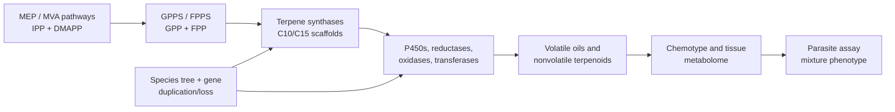

# Terpene diversity, biosynthetic evolution, and antiparasitic evidence across *Artemisia* species

## Abstract

The genus *Artemisia* contains a chemically diverse collection of volatile terpenes, nonvolatile terpenoids, and sesquiterpene lactones. This review develops a source-backed framework for comparing that chemistry across species while avoiding a common error: treating an essential-oil profile, a pathway gene, or an in-vitro parasite assay as a genus-wide pharmacological conclusion. We synthesize monoterpenes, sesquiterpenes, diterpenes, triterpenes, and sesquiterpene lactones; evaluate biosynthetic compartmentalization and gene-family evolution; and connect candidate pathway changes to chemotype and antiparasitic evidence. The best-resolved pathway is artemisinin biosynthesis in *A. annua*, but recent *A. argyi* results illustrate why gene presence/absence claims require assembly- and annotation-aware reconciliation. Essential-oil activity against *Leishmania* provides phenotype anchors, yet constituent attribution remains unresolved in mixture studies. We propose a reproducible, phylogeny-aware research program combining voucher-linked metabolomics, secretory-tissue transcriptomics, comparative genomics, enzyme assays, and fractionated parasite testing.

**Keywords:** *Artemisia*; terpenes; sesquiterpene lactones; artemisinin; chemotype; comparative genomics; essential oil; antiparasitic activity

## 1. Introduction

*Artemisia* is a large genus with substantial ecological, morphological, ploidy, and phytochemical diversity. Its volatile chemistry is concentrated especially in leaves and flowers, but reported profiles vary with genotype, chemotype, locality, tissue, ontogeny, harvest, drying, and extraction. Consequently, “the terpene profile of *Artemisia*” is not a single biological object; the appropriate unit of comparison is a documented specimen or accession with analytical context.

This review has two aims. First, it organizes the major terpene classes reported from *Artemisia* and summarizes the biosynthetic logic connecting precursor supply, synthase diversification, oxidation, lactonization, storage, and regulation. Second, it evaluates whether comparative evolutionary genomics can connect that diversity to antiparasitic phenotypes without overstating causality.

The evidence extraction unit is a specimen, accession, or explicitly bounded experimental preparation. Representative records are provided in `chemotype-table.csv`; they are not species means. The review follows the protocol in `review-protocol.md` and the source identifiers in `sources.json`.

## 2. Chemical scope and terminology

Terpenes are assembled from C5 isoprenoid units. Monoterpenes are principally C10, sesquiterpenes C15, diterpenes C20, and triterpenes C30; oxygenated and rearranged products are more precisely terpenoids. Sesquiterpene lactones are C15 terpenoids containing a lactone ring and are generally treated as extractable specialized metabolites rather than ordinary essential-oil constituents.

Representative volatile classes include pinene, limonene, myrcene, camphor, 1,8-cineole, borneol, thujones, germacrene D, β-caryophyllene, α-humulene, davanone, spathulenol, and caryophyllene oxide. Important nonvolatile or less volatile chemistry includes artemisinin and related compounds, guaianolide and germacranolide sesquiterpene lactones, and triterpenoids associated with plant surfaces and defense.

### 2.1 Evidence map by class

| Class | Representative *Artemisia* chemistry | Main analytical context | Review interpretation |
|---|---|---|---|
| Monoterpenes and oxygenated monoterpenes | α-/β-pinene, limonene, myrcene, camphor, 1,8-cineole, borneol, thujones, artemisia ketone | GC-MS/GC-FID of volatile oils and headspace fractions | Often abundant, but highly sensitive to chemotype, tissue, stage, drying, and distillation |
| Sesquiterpene hydrocarbons and oxygenated sesquiterpenes | germacrene D, β-caryophyllene, α-humulene, davanone, spathulenol, caryophyllene oxide | GC-MS of oils; targeted volatile profiling | Useful markers of population chemistry, not universal species signatures |
| Sesquiterpene lactones | artemisinin, arteannuin B, artemisinic acid, santonin, guaianolides, germacranolides, absinthin-related compounds | LC-MS/HPLC, NMR, isolation; GC is often unsuitable without derivatization | Usually nonvolatile; structural and stereochemical confirmation is critical |
| Diterpenes | species-specific diterpenoid constituents and chlorophyll-associated phytol derivatives | Solvent extraction, LC-MS, NMR; often reported in broad phytochemical surveys | Less comprehensively sampled than C10/C15 chemistry; presence should be linked to isolation or validated MS evidence |
| Triterpenes and sterols | β-amyrin/α-amyrin-, friedelin-, cycloartane- and sterol-associated reports | Solvent extraction, LC-MS, GC-MS after derivatization, NMR | Surface and storage chemistry; not part of ordinary essential-oil comparisons |

The unevenness of this evidence map is itself a result: volatile mono- and sesquiterpenes are overrepresented because they are accessible to routine GC analysis, whereas nonvolatile diterpenes, triterpenes, and lactones require extraction workflows that are less directly comparable across studies.

Primary studies show that the under-sampled classes are not merely theoretical. In *A. annua*, seed isolation recovered fourteen sesquiterpenes, three monoterpenes, and one diterpene ([Brown et al. 2003](https://pubmed.ncbi.nlm.nih.gov/12946429/)). Separate trichome transcriptome and heterologous-expression work functionally characterized the oxidosqualene cyclase OSC2 and P450 CYP716A14v2 in aerial-cuticle triterpenoid production ([Moses et al. 2015](https://pubmed.ncbi.nlm.nih.gov/25576188/)), while a diterpene-synthase study identified ten *A. annua* diTPS genes in a glandular-trichome and stress-resilience context ([Chen et al. 2021](https://pubmed.ncbi.nlm.nih.gov/33740256/)). These are class-specific anchors, not evidence that all *Artemisia* species share the same diterpene or triterpene repertoire.

## 3. Biosynthesis and compartmentalization

The plastidial MEP pathway and cytosolic mevalonate pathway supply IPP and DMAPP, which are condensed into prenyl diphosphates. GPPS and related enzymes provide C10 substrates for monoterpene synthases; FPPS provides the C15 substrate FPP for sesquiterpene synthases, including germacrene A synthase and ADS. Cytochrome P450s, reductases, dehydrogenases, oxidases, acyltransferases, glycosyltransferases, and spontaneous reactions expand the scaffold space.

Functionally characterized *A. annua* monoterpene synthases illustrate why copy number alone is insufficient: recombinant AaTPS2, AaTPS5, and AaTPS6 produced different product spectra, and transcript abundance changed after wounding and hormone treatments ([Ruan et al. 2016](https://pubmed.ncbi.nlm.nih.gov/27242840/)). Product specificity, inducibility, and tissue localization therefore need to be modeled together in evolutionary comparisons.

The artemisinin pathway in *A. annua* is the strongest gene-to-metabolite reference. ADS converts FPP to amorpha-4,11-diene; CYP71AV1 oxidizes pathway intermediates; DBR2 and ALDH1 support the route toward dihydroartemisinic acid, after which terminal chemistry includes nonenzymatic steps. Glandular secretory trichomes provide a relevant biosynthetic and storage context. These statements are pathway anchors, not proof that homologous genes in another species produce artemisinin or confer antiparasitic activity.

Germacranolide biosynthesis offers a second comparative framework: FPP can be cyclized by germacrene A synthase, oxidized by germacrene A oxidase, and converted through P450-dependent chemistry and lactonization. The broad presence of a scaffold family does not imply identical product profiles because enzyme specificity, tissue localization, substrate competition, and downstream modification differ.

**Pathway evidence boundary.** The ordered pathway model is a set of evidence-qualified hypotheses. Direct enzyme characterization supports individual steps; a homologous sequence or transcript supports candidate function; a detected metabolite supports presence in the sampled material. None of these alone establishes flux, compartment, or in-vivo production in a second species. Multi-substrate requirements, physiological direction, stereochemistry, and missing transport or cofactor information must remain explicit in the Terpedia pathway records.

**Figure 1. Conceptual route from precursor supply to phenotype.**

## 4. Species and chemotype diversity

*A. annua* combines artemisinin-pathway chemistry with variable volatile oils that may include artemisia ketone, camphor, germacrene D, and 1,8-cineole. *A. absinthium* can show thujone-, camphor-, cineole-, davanone-, or chamazulene-associated profiles depending on provenance and stage. *A. herba-alba*, *A. vulgaris*, and *A. argyi* likewise show regional and tissue-level variation. *A. dracunculus* is a useful boundary case because estragole may dominate some oils; estragole is not a terpene and should remain in a broader volatile-metabolite record.

Geography and climate can alter both the relative abundance and the dominant chemical class. Phenological shifts may change monoterpene and sesquiterpene proportions between vegetative and flowering stages. Drying and distillation can remove, transform, or concentrate constituents. These effects explain why percentage tables cannot be pooled without specimen-level metadata and analytical harmonization.

The same principle applies to apparently stable markers. Germacrene D is dominant in many *A. frigida* samples, yet the distribution of that dominance and its relationship to climate must be evaluated across populations and years. Recent *A. absinthium* work similarly shows that geography and phenological stage can change the dominant oxygenated mono- versus sesquiterpene class. These studies support stratified comparisons rather than a single canonical “wormwood oil.”

## 5. Comparative evolutionary genomics

The initial controlled comparison is *A. annua* versus *A. argyi*. The former supplies a pathway-rich reference genome and functional artemisinin literature. The latter has a chromosome-scale genome with reported whole-genome duplication and terpene-synthase expansion, plus tissue transcriptomes. A recent *A. argyi* analysis reports six tandem-duplicated ADS homologs, whereas an earlier genome interpretation treated functional ADS capacity as absent or unresolved. This is a high-value reconciliation problem, not a settled presence/absence result.

The comparative analysis should infer orthogroups and gene trees for GPPS, FPPS, monoterpene synthases, sesquiterpene synthases, ADS, CYP71AV1-like P450s, DBR2, ALDH1, OSCs, and selected sesquiterpene-lactone enzymes. Duplications and losses should be mapped to a broad *Artemisia* species tree. Expression should be interpreted by tissue and developmental context, with glandular trichome data prioritized where available. Missing annotation is unresolved data, not evidence of biological absence.

## 6. Antiparasitic evidence

Published essential-oil studies provide useful phenotype anchors. *A. annua* leaf oil has been tested against *Leishmania donovani* in in-vitro and in-vivo contexts. Oils from *A. campestris* and *A. herba-alba* have been tested against *L. infantum* promastigotes, with apoptosis-like and cell-cycle-associated effects reported. These results support mixture-level activity under the reported experimental conditions. They do not establish a single active terpene, whole-life-cycle efficacy, host safety, or clinical benefit.

The quantitative assay records are separated in `antiparasitic-evidence.csv` so that parasite stage, preparation, endpoint, dose, host control, and translation boundary remain visible. For example, the camphor-rich *A. annua* oil reported IC50 values of 14.63 +/- 1.49 microgram/mL against promastigotes and 7.3 +/- 1.85 microgram/mL against intracellular amastigotes, plus an approximately 90% liver/spleen burden reduction at 200 mg/kg in infected mice. Those observations belong to one hydrodistilled oil and its experimental model; they are not evidence that camphor alone, or *A. annua* generally, produces the effect.

An Ethiopian study of *A. abyssinica* further illustrates why selectivity must be reported with activity: its oxygenated-monoterpene-rich oil showed activity against *Leishmania* promastigote and amastigote systems but also variable toxicity in mammalian-cell and erythrocyte assays. This is a valuable comparative record because it carries parasite stage and host-toxicity information together, although it still does not resolve which constituents or interactions drive the result.

The strongest causal bridge would require matched specimen chemistry, parasite-stage assays, host-cell cytotoxicity, fractionation or defined mixtures, and ideally purified-compound plus combination testing. Gene expression or a predicted pathway can prioritize candidates but cannot replace those experiments.

## 7. Safety and translation

Thujone is neurotoxic and must be tracked as a quantified, preparation-specific analyte. Artemisinin-derived antimalarial treatment should not be conflated with crude *A. annua* tea, essential oil, or an unidentified *Artemisia* preparation. In-vitro antioxidant, antimicrobial, insecticidal, cytotoxic, or antiparasitic results do not establish a safe human dose or therapeutic efficacy.

## 8. Testable hypotheses and research agenda

We propose four hypotheses: (1) WGD- and lineage-specific TPS retention predicts chemical diversity only when copy number is paired with expression and metabolomics; (2) antiparasitic chemistry associated with artemisinin-like products tracks pathway completion more closely than total TPS count; (3) essential-oil activity is often a chemotype-specific mixture property; and (4) secretory-tissue expression predicts accumulated compounds better than bulk leaf expression. Discriminating tests combine frozen assemblies, standardized annotation, orthology-aware gene trees, trichome transcriptomics, targeted metabolomics, enzyme assays, and fractionated parasite assays.

### 8.1 Minimum reporting standard for a future meta-analysis

Each observation should be stored as a specimen-level record with a stable taxon identifier, voucher or accession, tissue, developmental stage, locality and collection date, preparation, extraction yield, analytical platform, retention-index or spectral confirmation, compound identity confidence, abundance units, and assay metadata. A quantitative synthesis should not pool normalized peak percentages with absolute concentrations, purified compounds with oils, or promastigote-only endpoints with intracellular or in-vivo endpoints. This design makes heterogeneity a modeled variable rather than an unexplained nuisance.

## 9. Conclusions

*Artemisia* terpene biology is best understood as a structured interaction between evolutionary history, gene-family innovation, tissue compartmentalization, ecological context, and analytical method. A publishable comparative review must therefore preserve specimen-level provenance and separate observed chemistry, direct enzyme evidence, annotation-supported hypotheses, mixture-level phenotypes, and unestablished claims. The Terpedia-linked dataset and protocol provide the basis for expanding this draft into a fully screened, quantitatively harmonized review.

## Data and code availability

The manuscript protocol, source registry, evidence matrix, representative chemistry table, and Terpedia-linked pathway records are versioned with this article package. Genome and transcriptome sequence data remain in their originating public repositories; the article package records accession identifiers and retrieval metadata rather than redistributing sequence files. Future analysis notebooks should use the frozen manifests and record software versions, parameters, checksums, and execution environment.

## Core sources

See `sources.json` for the auditable registry. Key anchors include the genus essential-oil review (https://pmc.ncbi.nlm.nih.gov/articles/PMC6268508/), the *Artemisia* sesquiterpene-lactone analysis review (https://pmc.ncbi.nlm.nih.gov/articles/PMC4606394/), the *A. annua* chemotype metabolomics study (https://pmc.ncbi.nlm.nih.gov/articles/PMC5968107/), the *A. annua* genome study (https://doi.org/10.1016/j.molp.2018.03.015), the *A. argyi* chromosome-scale genome (https://pmc.ncbi.nlm.nih.gov/articles/PMC10203441/), the recent *A. argyi* comparison (https://pmc.ncbi.nlm.nih.gov/articles/PMC12702566/), the broad *Artemisia* phylogenomics framework (https://pmc.ncbi.nlm.nih.gov/articles/PMC12508166/), and the *Leishmania* assay studies (https://pmc.ncbi.nlm.nih.gov/articles/PMC4243575/; https://pmc.ncbi.nlm.nih.gov/articles/PMC5078739/; https://pubmed.ncbi.nlm.nih.gov/20397218/).
