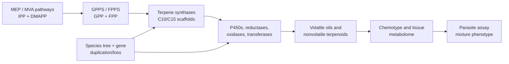
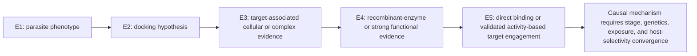

# Terpene diversity, biosynthetic evolution, and antiparasitic evidence across *Artemisia* species

## Abstract

The genus *Artemisia* contains a chemically diverse collection of volatile terpenes, nonvolatile terpenoids, and sesquiterpene lactones. This review develops a source-backed framework for comparing that chemistry across species while avoiding a common error: treating an essential-oil profile, a pathway gene, or an in-vitro parasite assay as a genus-wide pharmacological conclusion. Across 262 registered sources, we synthesize monoterpenes, sesquiterpenes, diterpenes, triterpenes, and sesquiterpene lactones; evaluate biosynthetic compartmentalization and gene-family evolution; and connect candidate pathway changes to chemotype and antiparasitic evidence. The best-resolved pathway is artemisinin biosynthesis in *A. annua*, but recent *A. argyi* results illustrate why gene presence/absence claims require assembly- and annotation-aware reconciliation. Malaria and artemisinin form the primary validated case study, while wormwood (*A. absinthium*) provides a separate, preparation-specific veterinary vermifuge/anthelmintic case. Essential-oil, extract, whole-leaf, and purified-compound assays provide phenotype anchors across protozoa, helminths, and vectors, yet constituent attribution remains unresolved in most mixture studies. We propose a reproducible, phylogeny-aware research program combining voucher-linked metabolomics, secretory-tissue transcriptomics, comparative genomics, enzyme assays, and fractionated parasite testing.

**Keywords:** *Artemisia*; terpenes; sesquiterpene lactones; artemisinin; chemotype; comparative genomics; essential oil; antiparasitic activity

## 1. Introduction

*Artemisia* is a large genus with substantial ecological, morphological, ploidy, and phytochemical diversity. Its volatile chemistry is concentrated especially in leaves and flowers, but reported profiles vary with genotype, chemotype, locality, tissue, ontogeny, harvest, drying, and extraction. Consequently, “the terpene profile of *Artemisia*” is not a single biological object; the appropriate unit of comparison is a documented specimen or accession with analytical context.

This review has two aims. First, it organizes the major terpene classes reported from *Artemisia* and summarizes the biosynthetic logic connecting precursor supply, synthase diversification, oxidation, lactonization, storage, and regulation. Second, it evaluates whether comparative evolutionary genomics can connect that diversity to antiparasitic phenotypes without overstating causality.

The evidence extraction unit is a specimen, accession, or explicitly bounded experimental preparation. Representative records are provided in `chemotype-table.csv`; they are not species means. The review follows the protocol in `review-protocol.md` and the source identifiers in `sources.json`.

### 1.1 What previous reviews establish-and what remains open

Yes, *Artemisia* terpene and terpenoid reviews have been published. The principal precedents include a genus-level essential-oil review, a 2012-2017 essential-oil update, a dedicated sesquiterpene-lactone analysis and methods review, a review of edible species and selected sesquiterpene lactones, a 2024 genus-wide phytochemistry, pharmacology, and toxicology review, a 2024 synthesis of STL biosynthesis/regulation/genomics, a 2024 evolution-focused STL review, a recent review focused on *A. herba-alba* and *A. judaica* chemistry and omics, a 2022 review of *A. annua* artemisinin biotechnology, a 2023 malaria-focused review of isolated *A. annua* and *A. afra* metabolites and PK/PD, a 2025 medicinal-chemistry review of *Artemisia* antimalarials, and an August 2026 systematic review of whole-plant *A. annua* tea ([Abad et al. 2012](https://pmc.ncbi.nlm.nih.gov/articles/PMC6268508/); [Pandey and Singh 2017](https://pubmed.ncbi.nlm.nih.gov/28930281/); [Ivanescu et al. 2015](https://pmc.ncbi.nlm.nih.gov/articles/PMC4606394/); [Trendafilova et al. 2021](https://pubmed.ncbi.nlm.nih.gov/33396790/); [Hussain et al. 2024](https://pubmed.ncbi.nlm.nih.gov/37711006/); [Frey et al. 2024](https://doi.org/10.1080/07352689.2024.2307240); [Agatha et al. 2024](https://pmc.ncbi.nlm.nih.gov/articles/PMC11449222/); [Al-Khayri et al. 2022](https://pmc.ncbi.nlm.nih.gov/articles/PMC9103073/); [Shinyuy et al. 2023](https://pmc.ncbi.nlm.nih.gov/articles/PMC10222324/); [Diab et al. 2026](https://doi.org/10.1007/s11101-025-10163-0); [Rauf et al. 2025](https://pubmed.ncbi.nlm.nih.gov/39192639/); [Munyangi Wa Nkola et al. 2026](https://pubmed.ncbi.nlm.nih.gov/42596018/)). These reviews establish the breadth of reported chemistry and biological claims, but they generally do not provide one specimen-level, class-balanced, phylogeny-aware evidence model connecting terpene chemistry, evolutionary genomics, tissue context, antiparasitic stage, and safety. The present package is designed as an auditable update and integration, not as a claim that prior reviews were absent or noncomprehensive.

### 1.2 Literature-search and evidence strategy

The literature review was organized around five linked evidence domains: (i) compound occurrence and analytical identity; (ii) enzyme, pathway, and compartment evidence; (iii) genotype, population, tissue, developmental, and environmental variation; (iv) comparative genomics and gene-family evolution; and (v) antiparasitic phenotype, target, and safety evidence. Searches combined *Artemisia* taxon terms with terpene-class, analytical, biosynthetic, genomic, and parasite terms. The reproducible search strings, dates, database results, de-duplication outputs, and title/abstract decisions are archived in `search-log.md`, `search-results.json`, and the screening CSV files. The working corpus contains both primary studies and prior reviews, but mechanistic and quantitative statements are preferentially anchored to primary studies.

Evidence was graded by what an experiment actually established. Isolation with NMR or a matched analytical standard supports compound identity in the tested material; GC-MS library matching supports a lower-confidence assignment unless retention-index and standard data are also available. Heterologous enzyme assays support catalytic capacity under the assay conditions, not native flux. Transcript abundance and co-expression prioritize candidates but do not prove product identity. Parasite growth inhibition supports a preparation-specific phenotype; causal target claims require biochemical, structural, genetic, or activity-based target-engagement evidence. This hierarchy allows broad coverage without converting association into mechanism.

The review is intentionally class-balanced. Essential-oil surveys dominate the searchable literature, but the synthesis separately tracks nonvolatile sesquiterpene lactones, diterpenes, triterpenes, and cuticular metabolites so that analytical convenience does not become a biological conclusion. Likewise, *A. annua* is treated as the best-resolved reference rather than a proxy for the genus. Evidence from *A. argyi*, *A. absinthium*, *A. herba-alba*, *A. afra*, *A. campestris*, and other species is retained with its own voucher, population, tissue, and preparation boundaries wherever those data are reported.

## 2. Chemical scope and terminology

Terpenes are assembled from C5 isoprenoid units. Monoterpenes are principally C10, sesquiterpenes C15, diterpenes C20, and triterpenes C30; oxygenated and rearranged products are more precisely terpenoids. Sesquiterpene lactones are C15 terpenoids containing a lactone ring and are generally treated as extractable specialized metabolites rather than ordinary essential-oil constituents.

Representative volatile classes include pinene, limonene, myrcene, camphor, 1,8-cineole, borneol, thujones, germacrene D, β-caryophyllene, α-humulene, davanone, spathulenol, and caryophyllene oxide. Important nonvolatile or less volatile chemistry includes artemisinin and related compounds, guaianolide and germacranolide sesquiterpene lactones, and triterpenoids associated with plant surfaces and defense.

### 2.1 Evidence map by class

**Table 1. Major terpene classes, analytical contexts, and interpretation limits in *Artemisia*.**

| Class | Representative *Artemisia* chemistry | Main analytical context | Review interpretation |
|---|---|---|---|
| Monoterpenes and oxygenated monoterpenes | α-/β-pinene, limonene, myrcene, camphor, 1,8-cineole, borneol, thujones, artemisia ketone | GC-MS/GC-FID of volatile oils and headspace fractions | Often abundant, but highly sensitive to chemotype, tissue, stage, drying, and distillation |
| Sesquiterpene hydrocarbons and oxygenated sesquiterpenes | germacrene D, β-caryophyllene, α-humulene, davanone, spathulenol, caryophyllene oxide | GC-MS of oils; targeted volatile profiling | Useful markers of population chemistry, not universal species signatures |
| Sesquiterpene lactones | artemisinin, arteannuin B, artemisinic acid, santonin, guaianolides, germacranolides, absinthin-related compounds | LC-MS/HPLC, NMR, isolation; GC is often unsuitable without derivatization | Usually nonvolatile; structural and stereochemical confirmation is critical |
| Diterpenes | species-specific diterpenoid constituents and chlorophyll-associated phytol derivatives | Solvent extraction, LC-MS, NMR; often reported in broad phytochemical surveys | Less comprehensively sampled than C10/C15 chemistry; presence should be linked to isolation or validated MS evidence |
| Triterpenes and sterols | β-amyrin/α-amyrin-, friedelin-, cycloartane- and sterol-associated reports | Solvent extraction, LC-MS, GC-MS after derivatization, NMR | Surface and storage chemistry; not part of ordinary essential-oil comparisons |

The unevenness of this evidence map is itself a result: volatile mono- and sesquiterpenes are overrepresented because they are accessible to routine GC analysis, whereas nonvolatile diterpenes, triterpenes, and lactones require extraction workflows that are less directly comparable across studies.

Primary studies show that the under-sampled classes are not merely theoretical. In *A. annua*, seed isolation recovered fourteen sesquiterpenes, three monoterpenes, and one diterpene ([Brown et al. 2003](https://pubmed.ncbi.nlm.nih.gov/12946429/)). Separate trichome transcriptome and heterologous-expression work functionally characterized the oxidosqualene cyclase OSC2 and P450 CYP716A14v2 in aerial-cuticle triterpenoid production ([Moses et al. 2015](https://pubmed.ncbi.nlm.nih.gov/25576188/)), while a diterpene-synthase study identified ten *A. annua* diTPS genes in a glandular-trichome and stress-resilience context ([Chen et al. 2021](https://pubmed.ncbi.nlm.nih.gov/33740256/)). These are class-specific anchors, not evidence that all *Artemisia* species share the same diterpene or triterpene repertoire.

### 2.2 Monoterpenes and volatile sesquiterpenes

Monoterpenes are the most method-accessible *Artemisia* terpenoids. Across oils, recurrent chemistries include pinene and limonene hydrocarbons, camphor, borneol, 1,8-cineole, thujones, and irregular-monoterpene products such as artemisia ketone. Volatile sesquiterpenes add germacrene D, β-caryophyllene, α-humulene, caryophyllene oxide, davanone, spathulenol, and related oxygenated products. These names should be treated as reported identities with confidence levels, not interchangeable biomarkers: retention-index agreement, authentic-standard co-injection, mass-spectrum library matching, and NMR confirmation provide different evidentiary strength.

The biological unit is often a glandular-trichome or aerial-tissue oil, not a purified constituent. In *A. annua*, three recombinant monoterpene synthases generated distinct product spectra, while wounding and hormone treatment changed transcript levels. This connects volatile chemistry to enzyme specificity and inducible regulation, but it does not show that the induced oil is antiparasitic. In *A. frigida* and *A. absinthium*, population, geography, and phenology alter the relative abundance of volatile compounds. A cross-species comparison should therefore model presence/absence, relative abundance, and analytical detectability separately.

Enzyme studies reveal why one-gene/one-compound annotation is often inadequate. Recombinant *A. annua* epi-cedrol synthase produced epi-cedrol as its major oxygenated C15 product but also generated several olefinic sesquiterpenes and showed lower activity with the C10 precursor GPP ([Mercke et al. 1999](https://pubmed.ncbi.nlm.nih.gov/10486140/)). Two additional *A. annua* sesquiterpene-cyclase cDNAs and later transient-expression experiments expanded the functionally tested synthase repertoire ([Van Geldre et al. 2000](https://pubmed.ncbi.nlm.nih.gov/10996256/); [Kanagarajan et al. 2012](https://pubmed.ncbi.nlm.nih.gov/22565787/)). Product multiplicity means that an expanded TPS clade can increase chemical opportunity without predicting a unique metabolite, while heterologous expression can reveal catalytic potential that may be constrained by native substrate supply or cell type.

Downstream enzymes further diversify volatile products. A glandular-trichome-specific *A. annua* alcohol dehydrogenase oxidized monoterpene alcohol substrates in recombinant assays, demonstrating that volatile profiles reflect not only cyclization but subsequent redox chemistry ([Polichuk et al. 2010](https://pubmed.ncbi.nlm.nih.gov/20621795/)). At the regulatory level, AabHLH112 perturbation changed β-caryophyllene, epi-cedrol, and β-farnesene-associated sesquiterpene metabolism, connecting a transcription factor to several non-artemisinin branches rather than a single endpoint ([Xiang et al. 2022](https://pmc.ncbi.nlm.nih.gov/articles/PMC9478121/)). Conversely, suppression of β-caryophyllene synthase increased artemisinin-pathway output in transgenic plants, providing direct evidence that FPP-consuming branches can compete for precursor under at least some engineered conditions ([Chen et al. 2011](https://pubmed.ncbi.nlm.nih.gov/21509717/)).

Population studies show an orthogonal source of complexity. Oils of *A. campestris* and *A. herba-alba* varied among natural populations, and their non-parasitic bioassay profiles varied with composition ([Younsi et al. 2017](https://pubmed.ncbi.nlm.nih.gov/28488391/)). In *A. herba-alba*, analysis of 80 individuals from eight Tunisian populations resolved four oil chemotypes and found substantial within-population marker diversity; global chemical divergence was not reducible to geographic or bioclimatic distance alone ([Younsi et al. 2018](https://pubmed.ncbi.nlm.nih.gov/29421510/)). A controlled comparison of five Iranian species further illustrates the scale and limits of cross-species variation: 20-34 compounds were assigned by GC-MS per species, artemisinin ranged from 0.12 to 0.41 mg/g dry weight, and dominant volatiles differed markedly, including camphor-rich *A. fragrans*, beta-thujone-rich *A. absinthium*, and beta-farnesene-rich *A. biennis* ([Jamshidi et al. 2024](https://pmc.ncbi.nlm.nih.gov/articles/PMC10909637/)). The same study found no uniform correlation between artemisinin content and the relative expression of the surveyed pathway genes. Because the plants were grown under a common controlled regime and GC-MS assignments were not all confirmed by isolation, this is an accession- and method-bounded comparison rather than a species-wide chemotype or evolutionary gain/loss test. These observations argue for individual- or population-level sampling and against using a single oil chromatogram as a species diagnostic.

A fifteen-population study of *A. vulgaris* makes the safety implication concrete: davanone, germacrene D, 1,8-cineole, camphor, thujone, and cis-chrysanthenyl acetate each dominated different Lithuanian oils, and brine-shrimp toxicity varied across the profiles ([Judzentiene and Garjonyte 2016](https://pubmed.ncbi.nlm.nih.gov/30807041/)). The result supports chemotype-stratified toxicology, but brine-shrimp LC0 values are not mammalian therapeutic windows and do not identify a single toxic constituent. Similarly, oral *A. argyi* oil produced rapid rat absorption and distribution of eight volatile constituents, including eucalyptol, alpha-thujone, camphor, borneol, bornyl acetate, beta-caryophyllene, and caryophyllene oxide, with prominent tissue exposure followed by prompt elimination ([Hou et al. 2021](https://pubmed.ncbi.nlm.nih.gov/34479182/)). This is disposition evidence for a defined oil preparation, not proof of antiparasitic efficacy or a safe human dose.

Newer wormwood analyses reinforce the need to treat geography, phenology, and authentication as causal design variables rather than metadata. *A. absinthium* oils shifted among oxygenated monoterpene-, oxygenated sesquiterpene-, and monoterpene-hydrocarbon-dominated profiles across sites and flowering stages ([Malaspina et al. 2025](https://pubmed.ncbi.nlm.nih.gov/40387081/)). A separate low-thujone oil was dominated by trans-sabinyl acetate, with trans-thujone only 1.2 +/- 0.5% in the reported sample ([Judzentienė and Būdienė 2026](https://pubmed.ncbi.nlm.nih.gov/42197106/)). Conversely, authenticated and commercial oils formed distinct thujone/camphor/ocimene-epoxide clusters, and alpha- and beta-thujone produced tephritid behavioral or toxicity endpoints ([Tabanca et al. 2025](https://pubmed.ncbi.nlm.nih.gov/41358348/)). These records support lot-specific chemical authentication and safety testing; they do not permit the species name “wormwood” to stand in for a defined thujone exposure or a vermifuge dose.

### 2.3 Diterpenes and triterpenes

Diterpene evidence is comparatively sparse and often mixed into broad phytochemical surveys. The *A. annua* seed study provides isolation-level evidence for one diterpene among three monoterpenes and fourteen sesquiterpenes, while a dedicated *A. annua* study identified ten diterpene synthases in relation to glandular trichome formation, artemisinin production, and stress resilience. A multi-platform *A. absinthium* oil analysis additionally reported diterpene- and homoditerpene-associated constituents alongside GC and NMR confirmation ([Judzentiene et al. 2009](https://pubmed.ncbi.nlm.nih.gov/19768995/)). These findings support a real C20 biosynthetic dimension but not a genus-wide diterpene chemotype. Diterpene records should preserve seed versus leaf or trichome tissue, extraction polarity, and whether the compound was isolated or only assigned by MS.

Triterpenes and sterols are especially important for avoiding a false “essential-oil-only” view of *Artemisia*. OSC2 and CYP716A14v2 were functionally connected to α-, β-, and δ-amyrin-related cuticular triterpenoids in *A. annua*, and triterpenoids have also been isolated from *A. igniaria*. Their cuticle or surface-associated localization suggests roles in barrier and stress biology, but current records do not support transferring those roles to antiparasitic action. Because triterpenes are less volatile, a GC-only survey can systematically under-report them.

The current diterpene and triterpene literature remains too sparse and methodologically heterogeneous for a genus-wide abundance synthesis. A defensible survey should distinguish a structurally isolated C20 or C30 metabolite from a tentative LC-MS feature, and it should separate pathway-gene discovery from measured products. The *A. annua* diterpene-synthase study is unusually informative because it combined gene discovery with developmental and physiological perturbation, whereas the OSC2/CYP716A14v2 work paired trichome comparisons with recombinant functional tests. These studies provide reference loci for comparative genomics, but their products must be re-measured in homologous tissues before copy-number differences are interpreted as ecological or antiparasitic adaptations.

Targeted primary isolations confirm that the sparse C20/C30 literature reflects under-sampling rather than an absence of chemistry. *A. sacrorum* yielded an ent-kauranoid diterpene diglycoside and two known ent-kauranoids; *A. caruifolia* yielded a new triterpene with co-isolated lignans; and whole-plant *A. sphaerocephala* yielded a new oleanane-type triterpenoid saponin ([Li et al. 1990](https://pubmed.ncbi.nlm.nih.gov/2213035/); [Ma et al. 2001](https://pubmed.ncbi.nlm.nih.gov/11217106/); [Li et al. 2008](https://pubmed.ncbi.nlm.nih.gov/19085421/)). Petroleum-ether fractionation of *A. argyi* further identified nordammarane and cycloartane triterpenoids, while *A. vulgaris* yielded both new sesquiterpenoids and triterpenoids with structure confirmation ([Zhang et al. 2020](https://pubmed.ncbi.nlm.nih.gov/30585504/); [Liu et al. 2022](https://pubmed.ncbi.nlm.nih.gov/36108986/)). These records establish chemical space and analytical identity; their cytotoxic, alpha-glucosidase, or anti-inflammatory endpoints do not establish antiparasitic activity. A genome-wide *A. annua* OSC survey identified 24 genes across CAS, LAS, LUS, and unknown subfamilies and reported differential expression under UV-B, but its bioinformatic and expression evidence still requires product-level and recombinant-enzyme validation ([Guo et al. 2025](https://pmc.ncbi.nlm.nih.gov/articles/PMC12293385/)).

Sesquiterpene engineering supplies a complementary functional anchor. Coexpression of valencene synthase and valencene oxidase in *A. annua* produced nootkatone, and plastid-targeted constructs reached 12.11-47.80 microgram/g fresh weight without changing artemisinin production ([Gou et al. 2021](https://pubmed.ncbi.nlm.nih.gov/33973783/)). The result demonstrates that substrate compartment and enzyme choice can redirect C15 flux in an engineered plant, but it is not evidence that nootkatone is a native *A. annua* chemotype or an antiparasitic constituent.

### 2.4 Sesquiterpene lactones

Sesquiterpene lactones (STLs) include guaianolide, germacranolide, eudesmanolide, and related structural families. Their α-methylene-γ-lactone or other electrophilic motifs can react with nucleophiles, which provides a chemically plausible basis for bioactivity but not a demonstrated parasite target. In *Artemisia*, STL reports include artemisinin-related amorphane chemistry, santonin, and numerous guaianolide and germacranolide constituents. Analytical workflows differ from oil profiling: LC-MS, isolation, multidimensional NMR, and stereochemical assignment are often needed, while direct GC percentages are not a suitable universal denominator.

Wormwood provides an unusually useful analytical reference for this class. A validated HPLC-DAD method separated and quantified five sesquiterpene lactones, two lignans, and a polymethoxylated flavonoid in *A. absinthium* material and commercial preparations; HPLC-MS and HPLC-SPE-NMR also characterized absinthin degradation products and showed strong stability under several storage conditions ([Aberham et al. 2010](https://pubmed.ncbi.nlm.nih.gov/20886883/)). This is important for the vermifuge question because measured lactone exposure depends on extraction and storage, but the analytical record does not by itself establish anthelmintic activity or a safe dose.

Santonin adds a historically important but safety-limited branch to the wormwood question. A validated HPLC-UV method measured santonin in *A. cina* extracts and leaves from eight Kazakhstan *Artemisia* taxa, including *A. absinthium*, providing a practical lot-specific control for a compound formerly used as an anthelmintic ([Sakipova et al. 2017](https://pmc.ncbi.nlm.nih.gov/articles/PMC5354383/)). In a separate *A. cina* fractionation study, high-speed countercurrent chromatography removed santonin from a CO2 subcritical extract while the santonin-free preparation retained antinociceptive and anti-inflammatory activity ([Sakipova et al. 2020](https://pmc.ncbi.nlm.nih.gov/articles/PMC7355858/)). Because the latter endpoints were not parasite assays, these studies do not prove that santonin or santonin-free extract is a vermifuge. They do show why historical anthelmintic reputation, measured santonin exposure, preparation-level activity, and human safety must be analyzed as separate variables.

The best-defined biosynthetic model for a non-artemisinin STL branch begins with FPP cyclization to germacrene A, oxidation to germacrene A acid, and downstream P450-dependent oxidation and lactonization. The presence of a germacranolide-like metabolite is therefore compatible with several levels of evidence-from structural analogy to a fully demonstrated enzyme sequence-and those levels must not be collapsed. STL abundance should also be reported separately from volatile sesquiterpene abundance because extraction and storage can partition them differently. In *A. annua*, field measurements of glandular-trichome dynamics across leaf development and senescence, together with dead-versus-green leaf precursor profiles, show why tissue age and precursor conversion must be retained as explicit variables ([Lommen et al. 2006](https://pubmed.ncbi.nlm.nih.gov/16557475/); [Lommen et al. 2007](https://pubmed.ncbi.nlm.nih.gov/17628838/)). Enzyme evolution adds a testable explanation for structural diversification: a germacrene-A oxidase accepted all seven alternate sesquiterpene substrates tested in yeast, whereas amorphadiene oxidase was comparatively rigid; engineered active-site substitutions increased artemisinic-acid activity per enzyme but reduced stability ([Nguyen et al. 2019](https://pmc.ncbi.nlm.nih.gov/articles/PMC6836840/)). This supports catalytic promiscuity as an evolutionary opportunity, not a claim that every GAO homolog makes a native lactone.

A complementary combinatorial-engineering study showed that AaDBR2 and a *Tanacetum parthenium* CYP71CB1 could act on multiple sesquiterpene-lactone pathway substrates, enabling heterologous production of dihydrocostunolide, dihydroparthenolide, and hydroxylated derivatives ([Beyraghdar Kashkooli et al. 2019](https://pubmed.ncbi.nlm.nih.gov/30822491/)). Such catalytic plasticity offers a plausible route by which duplicated or recruited downstream enzymes can enlarge lactone chemical space, but it also warns against inferring a unique product from a gene-family label: substrate access, stereochemistry, compartment, and downstream turnover must be experimentally matched.

Evolutionary sequence-function work provides a complementary explanation for terpene diversity outside the lactone branch. By recombining naturally occurring residues between cyclic ADS and linear beta-farnesene synthase, Salmon et al. identified a small epistatic network in which one dominant substitution could activate cyclization and additional residues could suppress or restore it; the corresponding network also affected a *Citrus* homolog ([Salmon et al. 2015](https://pmc.ncbi.nlm.nih.gov/articles/PMC4327562/)). This is direct evidence that a few interacting amino-acid changes can alter TPS product topology in a heterologous assay. It motivates gene-tree- and structure-aware tests across *Artemisia*, but does not by itself identify ancestral states, native selection, or a parasite-relevant product.

Recent structure-confirmed isolations show that the genus contains substantially more STL architecture than the artemisinin branch alone suggests. *A. vulgaris* yielded twelve new and ten known guaianolides, with NMR, electronic-circular-dichroism, and crystallographic support for stereochemistry; *A. verlotorum* yielded seven new and nineteen known sesquiterpenoids, including uncommon bicyclic, iphionane, and oxygen-bridged eudesmanolide structures ([Chen et al. 2022](https://pmc.ncbi.nlm.nih.gov/articles/PMC9475137/); [Wang et al. 2023](https://pubmed.ncbi.nlm.nih.gov/37302761/)). Basin big sagebrush leaf fractionation and *A. nitrosa* isolation add geographically distinct, structure-confirmed lactone records, including a new germacrane-type lactone and known sesquiterpene series ([Anibogwu et al. 2024](https://pmc.ncbi.nlm.nih.gov/articles/PMC10892904/); [Kazymbetova et al. 2022](https://pmc.ncbi.nlm.nih.gov/articles/PMC9694440/)). The associated macrophage or cytotoxicity assays are useful for structure-activity context, but they are not antiparasitic evidence. These studies strengthen the evolutionary hypothesis that repeated germacrane, guaiane, and eudesmane diversification creates a large chemical search space; demonstrating lineage-specific pathway evolution still requires common annotations, gene trees, expression, and direct enzyme assays.

The artemisinin branch demonstrates how metabolite isolation, enzyme biochemistry, and nonenzymatic chemistry can be integrated. Dihydroartemisinic acid and its hydroperoxide were isolated as candidate late intermediates before genetic perturbation established a broader branch architecture ([Wallaart et al. 1999a](https://pubmed.ncbi.nlm.nih.gov/10096851/); [Wallaart et al. 1999b](https://pubmed.ncbi.nlm.nih.gov/10479327/)). CYP71AV1 disruption subsequently redirected metabolites toward arteannuin X and supported a major role for spontaneous oxidative chemistry in terminal artemisinin formation. The evidence therefore supports a hybrid pathway model: enzyme-controlled scaffold formation and oxidation establish the precursor pool, while storage environment and post-biosynthetic oxidation help determine terminal products.

Non-artemisinin lactones broaden both structural and pharmacological space. *A. gorgonum* yielded isolated guaianolide and germacranolide compounds with antiplasmodial testing, while *Artemisia*-derived or *Artemisia*-associated lactones such as dehydroleucodine have been tested against trypanosomatids. Dehydroleucodine inhibited cultured *T. cruzi* epimastigote growth and altered parasite physiology in a defined-compound study ([Brengio et al. 2000](https://pubmed.ncbi.nlm.nih.gov/10780563/)). Ten additional germacrane-type sesquiterpenoids, artemyrianosins A-J, were isolated and structurally characterized from aerial parts of *A. myriantha*; selected compounds showed 43.7-89.3 microM cytotoxicity against human hepatoma cell lines ([Zhang et al. 2022](https://pmc.ncbi.nlm.nih.gov/articles/PMC9058048/)). That study expands confirmed STL structural space, but its endpoint is anticancer cytotoxicity and should not be recoded as antiparasitic activity. Such studies are stronger for constituent attribution than an oil assay, but species provenance, parasite stage, exposure, and host-cell selectivity still prevent direct translation to therapeutic efficacy.

## 3. Biosynthesis and compartmentalization

The plastidial MEP pathway and cytosolic mevalonate pathway supply IPP and DMAPP, which are condensed into prenyl diphosphates. GPPS and related enzymes provide C10 substrates for monoterpene synthases; FPPS provides the C15 substrate FPP for sesquiterpene synthases, including germacrene A synthase and ADS. Cytochrome P450s, reductases, dehydrogenases, oxidases, acyltransferases, glycosyltransferases, and spontaneous reactions expand the scaffold space.

Functionally characterized *A. annua* monoterpene synthases illustrate why copy number alone is insufficient: recombinant AaTPS2, AaTPS5, and AaTPS6 produced different product spectra, and transcript abundance changed after wounding and hormone treatments ([Ruan et al. 2016](https://pubmed.ncbi.nlm.nih.gov/27242840/)). Product specificity, inducibility, and tissue localization therefore need to be modeled together in evolutionary comparisons.

The artemisinin pathway in *A. annua* is the strongest gene-to-metabolite reference. ADS converts FPP to amorpha-4,11-diene, a foundational enzyme result established in early biochemical work ([Bouwmeester et al. 1999](https://pubmed.ncbi.nlm.nih.gov/10626375/)); CYP71AV1 oxidizes pathway intermediates; DBR2 and ALDH1 support the route toward dihydroartemisinic acid, after which terminal chemistry includes nonenzymatic steps. Glandular secretory trichomes provide a relevant biosynthetic and storage context. These statements are pathway anchors, not proof that homologous genes in another species produce artemisinin or confer antiparasitic activity.

The pathway was assembled through convergent evidence rather than a single experiment. ADS cloning and bacterial expression established the first committed cyclization; a trichome-enriched cDNA strategy identified CYP71AV1 and demonstrated sequential oxidation of amorpha-4,11-diene and related intermediates; and DBR2 cloning showed reduction at the branch that favors dihydroartemisinic-acid-derived chemistry ([Chang et al. 2000](https://pubmed.ncbi.nlm.nih.gov/11185551/); [Teoh et al. 2006](https://pubmed.ncbi.nlm.nih.gov/16458889/); [Zhang et al. 2008](https://pubmed.ncbi.nlm.nih.gov/18495659/)). Stable-isotope feeding in intact growing plants supplied an independent carbon-flow perspective ([Schramek et al. 2010](https://pubmed.ncbi.nlm.nih.gov/19932496/)). Together, these data are considerably stronger than pathway reconstruction from annotation alone, yet even this reference pathway remains sensitive to developmental state, precursor competition, and terminal nonenzymatic conversion.

A 2025 enzyme study adds a distinct branch to the production model. AaDHAADH catalyzed bidirectional conversion between artemisinic acid and dihydroartemisinic acid; a P26L variant increased activity toward dihydroartemisinic acid production, and engineered yeast reached 3.97 g/L DHAA in a 5-L bioreactor ([Guo et al. 2025](https://pmc.ncbi.nlm.nih.gov/articles/PMC12022088/)). This is strong enzyme and metabolic-engineering evidence, but it does not demonstrate that AaDHAADH controls native *A. annua* flux in planta or that homologs in other *Artemisia* species have the same directionality or physiological importance.

Compartment evidence is equally important. Immunolocalization placed key artemisinin enzymes in apical cells of glandular secretory trichomes, and a trichome transcriptome enriched the candidate space for isoprenoid and downstream-modification genes ([Olsson et al. 2009](https://pubmed.ncbi.nlm.nih.gov/19664791/); [Wang et al. 2009](https://pmc.ncbi.nlm.nih.gov/articles/PMC2763888/)). Tissue-expression studies showed that terpene-metabolism genes are not uniformly expressed across roots, stems, leaves, and reproductive structures ([Olofsson et al. 2011](https://pmc.ncbi.nlm.nih.gov/articles/PMC3063820/)). A grafting study further implicated root-derived regulation of shoot trichomes and artemisinin-related metabolites, indicating that the producing cell is embedded in a whole-plant signaling system ([Wang et al. 2016](https://pubmed.ncbi.nlm.nih.gov/27339275/)).

These tissue and redox relationships were synthesized early in the artemisinin literature, which emphasized the coupled roles of trichomes, roots, reactive oxygen species, and regulatory enzymes ([Nguyen et al. 2011](https://pmc.ncbi.nlm.nih.gov/articles/PMC3110715/); [Wen and Yu 2011](https://pmc.ncbi.nlm.nih.gov/articles/PMC3263054/)). The reviews remain useful for organizing hypotheses, but pathway-step and quantitative claims are anchored here to primary enzyme, perturbation, and isotope-tracing studies.

Precursor supply and branch competition have been tested genetically. Bidirectional perturbation of AaHDR1 altered artemisinin and other terpenoids, supporting a role for MEP-pathway supply while also showing class-specific responses rather than a uniform increase ([Ma et al. 2017](https://pmc.ncbi.nlm.nih.gov/articles/PMC5281613/)). Suppression of β-caryophyllene synthase shifted carbon away from one sesquiterpene branch, and a T-DNA insertion line produced a broader change in terpenoid composition and crude-extract bioactivity ([Chen et al. 2011](https://pubmed.ncbi.nlm.nih.gov/21509717/); [Karaket et al. 2014](https://pubmed.ncbi.nlm.nih.gov/24689216/)). These perturbations support network competition, but engineered responses should not be assumed to describe standing natural variation.

Regulation is multilayered. Jasmonate-responsive AaERF1/AaERF2, glandular-trichome-specific WRKY1, AaMYB108, and the AaGSW1-AaYABBY5/AaWRKY9 complex have each been connected to artemisinin-pathway expression or metabolite accumulation through transgenic, interaction, and expression experiments ([Yu et al. 2012](https://pubmed.ncbi.nlm.nih.gov/22104293/); [Chen et al. 2017](https://pubmed.ncbi.nlm.nih.gov/28001315/); [Liu et al. 2023](https://pubmed.ncbi.nlm.nih.gov/36564967/); [Kayani et al. 2023](https://pubmed.ncbi.nlm.nih.gov/37098222/)). The emerging model is therefore not a simple linear pathway but a tissue-localized, environment-responsive network in which developmental programs and stress signals act on precursor supply, synthase branches, oxidation, and trichome capacity.

Germacranolide biosynthesis offers a second comparative framework: FPP can be cyclized by germacrene A synthase, oxidized by germacrene A oxidase, and converted through P450-dependent chemistry and lactonization. The broad presence of a scaffold family does not imply identical product profiles because enzyme specificity, tissue localization, substrate competition, and downstream modification differ.

In *A. annua*, a glandular-trichome cDNA library yielded a germacrene A synthase that converted FPP to germacrene A in heterologous assays ([Bertea et al. 2006](https://pubmed.ncbi.nlm.nih.gov/16579958/)). This creates an experimentally anchored comparator for germacranolide-like pathways and illustrates a general strategy for other species: first establish synthase product, then test downstream oxidases, tissue expression, and matching metabolites. Sequence similarity to germacrene synthase, by itself, is insufficient because closely related TPS proteins can differ in product spectra and because downstream enzymes may redirect a shared scaffold.

A historical biochemical anchor sits downstream of this framework: a purified *A. annua* leaf protein converted arteannuin B to artemisinin with 58% conversion under the reported assay conditions, with a Km of 0.5 mM and a pH optimum near 7.0–7.2 ([Dhingra and Narasu 2001](https://pubmed.ncbi.nlm.nih.gov/11181083/)). This supports a transformation step at the protein-assay level, but the paper does not resolve a modern gene identity, native in-planta flux, subcellular transport, or conservation of the activity in other *Artemisia* species.

**Pathway evidence boundary.** The ordered pathway model is a set of evidence-qualified hypotheses. Direct enzyme characterization supports individual steps; a homologous sequence or transcript supports candidate function; a detected metabolite supports presence in the sampled material. None of these alone establishes flux, compartment, or in-vivo production in a second species. Multi-substrate requirements, physiological direction, stereochemistry, and missing transport or cofactor information must remain explicit in the Terpedia pathway records.

**Figure 1. Conceptual route from precursor supply to phenotype.**

## 4. Species and chemotype diversity

*A. annua* combines artemisinin-pathway chemistry with variable volatile oils that may include artemisia ketone, camphor, germacrene D, and 1,8-cineole. *A. absinthium* can show thujone-, camphor-, cineole-, davanone-, or chamazulene-associated profiles depending on provenance and stage. *A. herba-alba*, *A. vulgaris*, and *A. argyi* likewise show regional and tissue-level variation. Multi-species Canadian oils reinforce that composition can differ substantially among taxa and regions ([Lopes-Lutz et al. 2008](https://pubmed.ncbi.nlm.nih.gov/18417176/)). *A. dracunculus* is a useful boundary case because estragole may dominate some oils; estragole is not a terpene and should remain in a broader volatile-metabolite record.

Geography and climate can alter both the relative abundance and the dominant chemical class. Phenological shifts may change monoterpene and sesquiterpene proportions between vegetative and flowering stages. Drying and distillation can remove, transform, or concentrate constituents. These effects explain why percentage tables cannot be pooled without specimen-level metadata and analytical harmonization.

Developmental chemistry is not restricted to wormwood. In davana (*A. pallens*), a two-season, three-stage study found that oil content was higher at full emergence of the flower heads; davanone and linalool declined toward seed set, whereas methyl/ethyl cinnamates, bicyclogermacrene, davana ether, 2-hydroxyisodavanone, and farnesol increased ([Mallavarapu et al. 1999](https://pubmed.ncbi.nlm.nih.gov/10563881/)). These trajectories make harvest stage and season necessary covariates in cross-species volatile comparisons, but they do not establish antiparasitic activity for any changing constituent.

Genetic and environmental components can be partially separated but rarely ignored. A linkage map identified loci affecting artemisinin yield in *A. annua*, providing direct evidence that segregating genetic variation contributes to the phenotype ([Graham et al. 2010](https://pubmed.ncbi.nlm.nih.gov/20075252/)). In contrast, salt exposure, phytohormone treatment, reproductive development, and methyl jasmonate each changed pathway or oil phenotypes within experimental genotypes ([Yadav et al. 2017](https://pubmed.ncbi.nlm.nih.gov/27263081/); [Maes et al. 2011](https://pubmed.ncbi.nlm.nih.gov/20874804/); [Arsenault et al. 2010](https://pubmed.ncbi.nlm.nih.gov/20724645/); [Wu et al. 2011](https://pubmed.ncbi.nlm.nih.gov/21267809/)). The DBR2-promoter study further linked promoter activity to high- and low-artemisinin chemotypes, showing how cis-regulatory variation at a branch point can contribute to pathway allocation ([Yang et al. 2015](https://pubmed.ncbi.nlm.nih.gov/25616735/)).

Quantitative genetics adds an older but useful within-species benchmark: artemisinin content in *A. annua* showed predominantly additive inheritance and high narrow-sense heritability, and selected hybrid lines reached up to 1.4% of dry-leaf mass ([Delabays et al. 2001](https://pubmed.ncbi.nlm.nih.gov/11772351/)). This supports selection as a source of reproducible chemotype variation, while leaving causal loci, linkage drag, genotype-by-environment stability, and terpene-network consequences unresolved.

Abiotic-stress studies extend this interaction beyond elicitor shorthand. Salt, cold, and waterlogging increased reported artemisinin content in one *A. annua* experiment, whereas drought did not, and each treatment produced a distinct transcriptome ([Vashisth et al. 2018](https://pmc.ncbi.nlm.nih.gov/articles/PMC5821844/)). In a separate two-variety experiment under arsenic stress, carrageenan oligomers and salicylic acid further changed antioxidant physiology and artemisinin yield ([Naeem et al. 2021](https://pubmed.ncbi.nlm.nih.gov/33818725/)). These studies support environment-by-genotype regulation hypotheses, not universal stress responses or production recommendations; contamination, elicitor dose, harvest timing, and non-target metabolites must be measured alongside artemisinin.

The same principle applies to apparently stable markers. Germacrene D is dominant in many *A. frigida* samples, yet the distribution of that dominance and its relationship to climate must be evaluated across populations and years. Recent *A. absinthium* work similarly shows that geography and phenological stage can change the dominant oxygenated mono- versus sesquiterpene class. These studies support stratified comparisons rather than a single canonical “wormwood oil.”

Post-harvest handling is part of the phenotype that reaches an assay. Controlled drying changed concentrations of artemisinin and its acid precursors in *A. annua* leaves ([Ferreira and Luthria 2010](https://pubmed.ncbi.nlm.nih.gov/20050663/)). Hydrodistillation, solvent extraction, headspace analysis, and direct tissue extraction sample different chemical spaces and may also create or remove products through heat, oxidation, hydrolysis, or volatility. A reproducible comparison must therefore treat extraction method, storage duration, temperature, moisture endpoint, and abundance denominator as model variables rather than descriptive footnotes.

Developmental series in *A. annua* make the confounding concrete: artemisinin and related sesquiterpenes were highest at particular vegetative stages, while the essential-oil mono:sesquiterpene ratio shifted from approximately 55:45 near the preflowering maximum to approximately 30:70 at other stages ([Woerdenbag et al. 1994](https://pubmed.ncbi.nlm.nih.gov/17236047/)). A separate two-genotype time series identified genotype- and stage-dependent marker sets that included artemisinic acid, arteannuin B, borneol, beta-farnesene, camphor, and lanceol ([Wang et al. 2009](https://pubmed.ncbi.nlm.nih.gov/19548188/)). In a broader Pakistan comparison of eight *Artemisia* species and two varieties, flowering-stage leaves generally had higher artemisinin, with the highest measured value in *A. dracunculus* var. *dracunculus* ([Mannan et al. 2011](https://pubmed.ncbi.nlm.nih.gov/22076766/)). This is useful for a cross-species harvest hypothesis, but the HPLC endpoint and field/geographic design do not establish a universal optimum for volatile terpenes or all *Artemisia* taxa. Thus, “chemotype” should be modeled jointly with development and genotype rather than treated as a static label.

A five-species comparison provides a useful cross-species test of this principle: variation in glandular-trichome density, artemisinin content, and expression of pathway genes was observed among *A. annua*, *A. deserti*, *A. absinthium*, *A. sieberi*, and *A. khorassanica* ([Salehi et al. 2018](https://pubmed.ncbi.nlm.nih.gov/30139985/)). This is stronger comparative evidence than extrapolating from a single *A. annua* genotype, but expression and metabolite association still require common-annotation orthology, enzyme assays, and matched specimen chemistry before they can be interpreted as evolutionary gain or loss.

### 4.1 *Artemisia argyi* as a tissue- and time-resolved comparator

The expanding *A. argyi* literature provides a useful counterweight to *A. annua*. De novo and full-length transcriptomes identified candidate genes across the MVA/MEP backbones, TPS families, P450s, and regulatory families, but these resources differ in tissue composition, assembly strategy, and annotation granularity ([Liu et al. 2018](https://pubmed.ncbi.nlm.nih.gov/29643397/); [Cui et al. 2021](https://pmc.ncbi.nlm.nih.gov/articles/PMC8258318/)). Targeted terpenoid measurements paired with bHLH-family analysis nominated regulatory candidates without claiming direct enzyme function ([Yi et al. 2021](https://pmc.ncbi.nlm.nih.gov/articles/PMC8801783/)). A second reference genome, assembled at 4.15 Gb with 147,248 predicted genes and 5,121 reported species-specific gene families, paired genome analysis with MeJA-responsive transcriptomics of terpenoid, flavonoid, and phenylpropanoid pathways ([Gao et al. 2024](https://pmc.ncbi.nlm.nih.gov/articles/PMC11239399/)). Its unusually large gene-model count and repeat-rich assembly are valuable resources but also illustrate why gene-family counts must be normalized to assembly, ploidy, and annotation quality before evolutionary interpretation.

Tissue-resolved metabolomics and transcriptomics showed that roots, stems, and leaves differ in both terpene-associated metabolites and candidate pathway expression; leaf-enriched MEP-pathway genes and co-expressed P450s formed hypotheses for subsequent functional testing ([Zhang et al. 2022](https://pubmed.ncbi.nlm.nih.gov/35568110/)). Temporal profiling across four harvest months reported changing volatile-oil levels and identified full-length transcripts correlated with monoterpene and sesquiterpene profiles ([Xu et al. 2022](https://pmc.ncbi.nlm.nih.gov/articles/PMC9501300/)). These studies demonstrate that tissue and harvest date can produce differences as large as those attributed to genotype.

An environmental perturbation study gives this tissue-and-genotype framework a mechanistic test. Low-phosphorus treatment increased caryophyllene in *A. argyi* volatile oil and fresh leaves, increased *AaTPS3* expression, and implicated *AaWRKY1* and *AaWRKY2* as negative regulators of *AaTPS3* ([Ma et al. 2026](https://pubmed.ncbi.nlm.nih.gov/41528559/)). The result supports nutrient-responsive regulation of a defined terpene branch in the tested material, but it should not be generalized to all *A. argyi* accessions or interpreted as an antiparasitic mechanism without matched parasite and host-selectivity assays.

Single-cell transcriptomics and matched metabolomics now resolve this problem at higher spatial resolution. Glandular trichomes and non-glandular tissues of *A. argyi* showed strongly different metabolite profiles, with sesquiterpenoids prominent among trichome-enriched terpenoid differences, and the single-cell atlas nominated developmental and TPS-expression programs ([Dong et al. 2026](https://pmc.ncbi.nlm.nih.gov/articles/PMC12946448/)). This is powerful candidate evidence, but co-expression edges and cell-type enrichment remain hypotheses until recombinant enzymes, gene perturbations, and isotope or product-feeding experiments establish catalytic sequence and flux.

## 5. Comparative evolutionary genomics

The initial controlled comparison is *A. annua* versus *A. argyi*. The former supplies a pathway-rich reference genome and functional artemisinin literature. The latter has a chromosome-scale genome with reported whole-genome duplication and terpene-synthase expansion, plus tissue transcriptomes. The apparent ADS contradiction is now interpretable as an assembly-, ploidy-, annotation-, and function-level discrepancy rather than a simple presence/absence result. The earlier chromosome-scale study selected a 3.89-Gb, 17-pseudochromosome haplotype-A projection, annotated 122 TPS genes, and described partial ADS deletion and loss of function. A later 7.88-Gb haplotype-resolved assembly predicted 451 TPS models, of which 261 were manually classified as intact, and identified a six-copy tandem ADS homolog cluster; recombinant AarADS proteins produced α-bisabolol rather than the amorpha-4,11-diene made by AanADS ([Chen et al. 2023](https://pmc.ncbi.nlm.nih.gov/articles/PMC10203441/); [Qi et al. 2025](https://pmc.ncbi.nlm.nih.gov/articles/PMC12702566/)). Thus, the later result supports ADS-family retention with functional divergence, while neither paper alone establishes an intact, expressed, artemisinin-producing pathway in *A. argyi*.

The comparative analysis should infer orthogroups and gene trees for GPPS, FPPS, monoterpene synthases, sesquiterpene synthases, ADS, CYP71AV1-like P450s, DBR2, ALDH1, OSCs, and selected sesquiterpene-lactone enzymes. Duplications and losses should be mapped to a broad *Artemisia* species tree. Expression should be interpreted by tissue and developmental context, with glandular trichome data prioritized where available. Missing annotation is unresolved data, not evidence of biological absence.

Published comparative results already provide testable anchors: the later *A. argyi* analysis reports 451 predicted TPS models split between two haplotypes (221 and 230), with 261 intact models after manual correction, while the chromosome-scale study links WGD and duplication modes to TPS expansion and identifies a germacrene D synthase cluster. The latter study also reports pathway elucidation for germacrenes, (+)-borneol, and (+)-camphor. These observations are catalogued in the KB’s `gene-family-evidence.csv` and ADS/TPS reconciliation table; they are not treated as a substitute for a common-annotation, orthology-aware rerun.

The transcript and metabolite literature provides a validation ladder for genomic predictions. A candidate duplicated TPS is more compelling when it is intact under a common annotation, placed within a supported gene tree, retained in synteny or a tandem cluster, expressed in the relevant secretory cell, and correlated with a product that the recombinant protein can generate. The *A. argyi* tissue, temporal, and single-cell studies supply several of these intermediate layers, but none independently establishes orthology or ancestral function. In *A. annua*, by contrast, the mature ADS/CYP71AV1/DBR2 evidence chain shows what eventual convergence should look like. A functional *A. argyi* example is beta-caryophyllene synthase: four candidate synthases were identified, and engineered yeast expressing AarTPS88 reached 15.6 g/L beta-caryophyllene in fed-batch fermentation ([Li et al. 2025](https://pmc.ncbi.nlm.nih.gov/articles/PMC11532932/)). This validates a production-capable enzyme/cell-factory route, not native leaf abundance, ecological adaptation, orthology, or antiparasitic action.

Regulatory evolution should be evaluated with the same caution as enzyme evolution. The abundance of MYB, bHLH, WRKY, AP2/ERF, and light- or jasmonate-responsive candidates in transcriptomic analyses may reflect both genuine network expansion and permissive co-expression thresholds. Functional studies of AaERF1/AaERF2, WRKY1, AaMYB108, AabHLH112, and the AaGSW1 complex define experimentally testable motifs and interactions in *A. annua*, but homologous regulators in *A. argyi* should not inherit those functions by name alone. Conserved target motifs, protein interactions, cell-type expression, perturbation phenotypes, and metabolite responses are required to claim network conservation.

The Terpedia KB now carries an execution specification for this analysis (`comparative-genomics/`). Its required outputs include frozen input checksums, software versions, orthology-aware gene trees, synteny/tandem-cluster calls, and a tiered gene-family evidence table. A completed two-proteome OrthoFinder run is now archived, but the broader genus-wide comparison remains a design-supported hypothesis framework because the input contains only *A. annua* and one *A. argyi* annotation release.

An NCBI Datasets metadata audit was run without downloading sequence archives. It returned one *A. annua* assembly report and three separate *A. argyi* reports. The literature resource `PRJCA010808` was resolved to its external NGDC/CNCB project record, not to an NCBI assembly accession; the published 3.89-Gb, 17-pseudochromosome haplotype must therefore be treated as a distinct input until sequence and annotation files are obtained and checksummed. This is itself a result for reproducibility: assembly choice must be documented before copy-number or presence/absence comparisons are interpreted.

The KB’s assembly comparison table makes the confounders explicit: the *A. annua* NCBI reference is scaffold-level, the literature *A. argyi* input is a 3.89-Gb haplotype-A projection, and NCBI also exposes larger or differently assembled *A. argyi* resources. Genome length and chromosome count should therefore not be interpreted as evidence for terpene-family expansion without a common annotation and orthology workflow.

The execution gate is also explicit: NCBI reports an annotation with 63,226 protein-coding genes for the *A. annua* reference, and the earlier NGDC/CNCB *A. argyi* haplotype-A annotation exposes 62,844 protein-coding genes. These counts are not directly comparable to the later 7.88-Gb haplotype-resolved annotation. A seed-centered DIAMOND screen of 31 annotated *A. annua* pathway/TPS queries returned 105 *A. argyi* candidate hits; the exact inputs and hashes are archived in the KB. These are homology candidates only. A cross-species copy-number or orthology result is not reported until a common annotation, reciprocal/phylogenetic validation, and gene-tree reconciliation are completed.

Reciprocal checking re-searched 67 unique *A. argyi* candidates against the *A. annua* proteome and produced 26 reciprocal-best-hit candidate rows. Because a duplicated *A. argyi* locus can share the same best *A. annua* seed, this count is not a one-to-one ortholog count and is not interpreted as gene-family expansion.

As a diagnostic next step, the KB built MAFFT alignments and IQ-TREE3 exploratory trees for the three reciprocal groups that retained at least four unique protein sequences (PWA60940.1, PWA68009.1, and PWA85324.1). The run used the LG+G4 model, 1,000 ultrafast-bootstrap replicates, 1,000 SH-aLRT replicates, and one thread; the exact alignments, tree files, reports, software versions, and input checksums are archived under `comparative-genomics/results/seed-gene-trees-2026-09-01/`. Eight of eleven reciprocal groups were not tree-built because they had fewer than four leaves or fewer than four unique sequences. These small, seed-biased trees are quality-control diagnostics only: they do not establish orthology, duplication/loss, or pathway function.

A restricted OrthoFinder diagnostic then clustered the 31 *A. annua* seed proteins and 67 unique *A. argyi* forward-hit candidates. It produced 16 candidate orthogroups, 11 shared clusters, and five *A. argyi*-only clusters. The full tables, input FASTAs, software context, and checksums are archived in `comparative-genomics/results/candidate-orthofinder-2026-09-01/`. This result is useful for prioritizing follow-up gene trees and synteny, but the seed-biased, two-taxon candidate set cannot support genome-wide orthology, copy-number, duplication/loss, or gene-function claims.

To broaden pathway prioritization without overstating the unfinished full-proteome run, a separate annotation-keyword and homology-filtered analysis selected 890 *A. annua* pathway-associated proteins and 1,273 unique *A. argyi* candidates. OrthoFinder `-M msa -og` grouped these filtered inputs into 388 candidate orthogroups: 271 shared, 17 *A. annua*-only, and 100 *A. argyi*-only; 83 groups were single-copy in both filtered inputs. Because the query set is annotation-biased, the *A. argyi* set is homology-selected, and `-og` stops before species-tree and gene-tree inference, these counts are a reproducible prioritization scaffold rather than evidence of genome-wide orthology, copy-number change, duplication/loss, ancestral state, enzyme function, pathway flux, or antiparasitic mechanism. The complete tables, group sequences, command, software versions, input hashes, and checksums are archived in `comparative-genomics/results/pathway-focused-orthofinder-2026-09-02/`.

The full two-proteome run was then completed by resuming the finished DIAMOND searches with native ARM64 MCL and one OrthoFinder analysis thread ([Emms and Kelly 2019](https://pubmed.ncbi.nlm.nih.gov/31727128/)). It assigned 111,235 of 129,761 proteins (85.7%) to 28,696 orthogroups, including 25,039 groups containing both species, 7,086 single-copy groups, 3,657 species-specific groups, and 18,526 unassigned proteins. The inferred tree, `(A. annua, A. argyi)`, is a valid two-tip species tree but contains no information about relationships among the wider genus. The complete compressed result, log, input checksums, and execution note are archived in `comparative-genomics/results/artemisia-of-results-run3-full-2026-09-02.tar.gz` and `comparative-genomics/results/full-orthofinder-2026-09-02.md`.

Two published genome-scale studies provide important context for interpreting that restricted two-proteome comparison. An integrated *A. annua* multi-tissue dataset identified 88 metabolites across 14 tissues—26 monoterpenes, 22 sesquiterpenes, two triterpenes, and one diterpene—and connected developmental expression patterns with pathway-associated genes ([Ma et al. 2015](https://pubmed.ncbi.nlm.nih.gov/26192869/)). In *A. argyi*, an earlier 8.03-Gb allotetraploid assembly reported 135 TPS genes, tandem clusters, and tissue-biased expression alongside broad secondary-metabolism expansion ([Miao et al. 2022](https://pmc.ncbi.nlm.nih.gov/articles/PMC9491451/)). These studies support a class-balanced gene-to-metabolite design, but their assembly sizes, ploidy interpretations, annotation releases, and gene models are not directly interchangeable with the later 3.89-Gb or 7.88-Gb *A. argyi* resources. TPS counts and gene-expansion claims must therefore be re-evaluated after common annotation, homeolog-aware gene-tree placement, synteny, expression, and product confirmation.

An allele-aware *A. annua* assembly provides a complementary within-species evolutionary anchor. Two chromosome-level haplotype maps, paired with resequencing of 36 samples spanning artemisinin content, found a positive association between *amorpha-4,11-diene synthase* (ADS) copy number and artemisinin yield and enabled paralog-aware transcript detection ([Liao et al. 2022](https://pubmed.ncbi.nlm.nih.gov/35655434/)). This supports ADS dosage as a testable contributor to chemotype variation in *A. annua*, but it does not establish that every ADS-like copy is intact, expressed, or catalytically equivalent. In comparative work, copy number should therefore be modeled jointly with haplotype, gene-tree placement, transcript abundance, trichome localization, and measured artemisinin or precursor levels.

An annotation-anchored extraction mapped 35 *A. annua* proteins carrying curated pathway/TPS header labels to 21 pathway-label/group combinations, representing 17 assigned orthogroups plus one *A. annua* protein that remained unassigned. Several groups contain many copies in both species, but this is not evidence of a lineage-specific expansion: the labels are *A. annua* annotation anchors, *A. argyi* members have not inherited function by name, and OrthoFinder duplication counts are not equivalent to intact, expressed, biochemically active terpene loci. One particularly important caution is that the CYP71AV1 and germacrene-A-oxidase anchors fall in the same broad P450 orthogroup, illustrating why family membership must be followed by gene-tree placement and biochemical validation. The full per-protein mapping and grouped summary are archived in `comparative-genomics/results/full-pathway-family-mapping-2026-09-02.tsv` and `comparative-genomics/results/full-pathway-group-summary-2026-09-02.tsv`.

An important third genome-scale context is *A. tridentata*, a North American sagebrush with a haploid pseudo-chromosome assembly of approximately 4.2 Gbp, 43,377 predicted genes, 91.37% complete BUSCOs, and 77.99% repetitive sequence ([Melton et al. 2022](https://pmc.ncbi.nlm.nih.gov/articles/PMC9258541/)). A comparative resequencing study found extensive chromosomal rearrangements relative to *A. annua*, conserved large-scale synteny in selected regions, and population-level transposable-element differentiation among three diploid *A. tridentata* genomes ([Melton et al. 2024](https://pubmed.ncbi.nlm.nih.gov/38826031/)). More recent cytological and reduced-representation sequencing data support both one-step and two-step whole-genome-duplication pathways, including a possible triploid bridge and a reported 0.22% polyploidization rate in the study material ([Grossfurthner et al. 2026](https://pubmed.ncbi.nlm.nih.gov/42175621/)). These records materially strengthen the evolutionary design by showing that genome architecture and cytotype can vary within the genus, but they do not establish *A. tridentata* terpene-locus function or parasite activity. The NCBI assembly has no NCBI protein annotation, so the accession-matched Maker GFF3 released with the genome study was translated locally and retained with its source genome URL, assembly-name map, derivation script, and checksums in the Terpedia KB. This makes *A. tridentata* usable in a bounded candidate-family diagnostic while preserving the common-reannotation limitation.

The resulting three-species diagnostic searched the same 890 *A. annua* pathway-associated queries against the frozen *A. argyi* proteome and the 41,700-protein *A. tridentata* translation, recovering 1,273 and 768 candidate homologs, respectively. OrthoFinder `-S diamond -M msa -og` grouped the filtered inputs into 478 candidate orthogroups, of which 205 contained all three species and 31 were single-copy in all three. Pairwise shared-group counts were 291 for *A. annua–A. argyi*, 236 for *A. annua–A. tridentata*, and 265 for *A. argyi–A. tridentata*. These values are useful for selecting loci for gene trees, synteny, expression, and enzyme assays, but the query and target sets are homology-selected, annotations are not common-reannotated, and `-og` stops before gene-tree/species-tree reconciliation. They therefore do not support genome-wide copy-number, duplication/loss, ancestral-state, pathway-flux, or antiparasitic-mechanism claims. The full candidate tables, filtered FASTAs, OrthoFinder log, provenance manifest, and checksums are archived in `comparative-genomics/results/three-species-pathway-orthofinder-2026-09-02/`.

At broader genus scale, flow cytometry across 21 *Artemisia* species and 24 populations measured 2C DNA contents from 3.5 to 25.65 pg, with strong associations to karyotype length and ploidy and additional systematic/ecological structure ([Torrell and Vallès 2001](https://pubmed.ncbi.nlm.nih.gov/11341733/)). Genome size is therefore a relevant covariate for sampling and orthology interpretation, especially where homeolog retention and chromosome-scale duplication can mimic lineage-specific terpene-gene expansion. It is not, however, a proxy for TPS copy number, pathway completeness, metabolite abundance, or antiparasitic function.

**Table 4. Selected annotation-anchored groups from the completed two-proteome run.** Counts are OrthoFinder group membership and duplication diagnostics, not functional copy-number calls.

| *A. annua* annotation anchor | Orthogroup | *A. annua* / *A. argyi* genes | Duplications | Gene-tree leaves | Boundary |
|---|---|---:|---:|---:|---|
| CYP71AV1; germacrene-A oxidase | OG0000295 | 19 / 8 | 21 | 27 | Broad P450 group; shared group does not distinguish CYP71AV1 from GAO function |
| DBR2; artemisinic-aldehyde reductase labels | OG0006177 | 3 / 1 | 2 | 4 | Compact shared group; exact enzyme assignment requires sequence/function checks |
| Germacrene-A synthase | OG0011988 | 2 / 1 | not reported | not built | Three total members fell below the gene-tree output threshold |
| Germacrene-A synthase 2 | OG0001344 | 5 / 6 | 7 | 11 | Candidate TPS family; *A. argyi* function unverified |
| Germacrene-D synthase; sesquiterpene synthase 4 | OG0000309 | 17 / 10 | 19 | 27 | Mixed TPS labels and duplication-rich group; no product transfer inferred |
| Farnesyl diphosphate synthase 2 | OG0000439 | 16 / 5 | 16 | 21 | Prenyl-transferase group; not a direct flux or abundance comparison |
| Oxidosqualene cyclase 3 | OG0001412 | 9 / 1 | 8 | 10 | Candidate triterpene branch group; *A. argyi* member remains uncharacterized |
| Geranylgeranyl pyrophosphate synthase | OG0009299 | 1 / 3 | 2 | 4 | Shared prenyl-transferase group; copy number is annotation- and assembly-dependent |

An independent *A. argyi* leaf, root, and stem transcriptome supplies candidate terpenoid-biosynthesis transcripts and tissue contrasts ([Liu et al. 2018](https://pubmed.ncbi.nlm.nih.gov/29643397/)). It extends the comparison beyond *A. annua*, but de novo transcript annotation cannot distinguish paralogs, homeologs, and allelic copies reliably enough for gene-family evolution without genome-guided placement. Experimental work on an *A. annua* (E)-β-farnesene synthase further shows that a sparse set of epistatic sequence changes can alter terpene-enzyme behavior ([Ballal et al. 2020](https://pubmed.ncbi.nlm.nih.gov/32119077/)); this motivates testing sequence-function effects within orthologous clades rather than treating all TPS copies as functionally equivalent.

Environmental and perturbation studies provide useful mechanistic tests within *A. annua*. Short-term UV-B exposure increased artemisinin production and induced ADS, CYP71AV1, and stress/hormone-associated transcripts ([Pan et al. 2014](https://pubmed.ncbi.nlm.nih.gov/25194528/)). A CYP71AV1 mutant redirected flux toward the alternate sesquiterpene epoxide arteannuin X and supported nonenzymatic terminal conversion in glandular trichomes ([Czechowski et al. 2016](https://pubmed.ncbi.nlm.nih.gov/27930305/)). These results demonstrate inducibility and metabolic plasticity, but they do not establish that a homologous response or alternate product occurs in another *Artemisia* species.

Recent within-species studies add actionable controls for this comparative design. In a 17-bioecotype panel, gene-specific STS markers and HPLC identified marker-yield associations and bioecotypes exceeding 2.7 mg/g artemisinin, but the correlations remain selection signals rather than causal variant assignments ([Hallajian et al. 2026](https://pubmed.ncbi.nlm.nih.gov/42232768/)). AaSPATULA perturbation connected glandular-trichome initiation with biomass and whole-plant artemisinin yield, while AaMYC3 linked jasmonate response, trichome density, and pathway-gene activation ([Yuan and Zhou 2026](https://pubmed.ncbi.nlm.nih.gov/42030805/); [Yuan et al. 2025](https://pubmed.ncbi.nlm.nih.gov/39189077/)). TLR3 and differentially expressed lncRNAs provide additional plant-side regulatory candidates ([Dong et al. 2024](https://pubmed.ncbi.nlm.nih.gov/38500223/); [Ma et al. 2024](https://pubmed.ncbi.nlm.nih.gov/39598260/)). The common inference boundary is important: improved trichome capacity or artemisinin yield does not, by itself, predict antiparasitic potency unless the resulting chemical fingerprint and parasite exposure are measured.

The older regulatory literature provides a useful perturbation ladder for interpreting these newer candidates. TAR1 altered trichome morphology, cuticular wax, ADS/CYP71AV1 expression, and artemisinin; trichome-specific AaWRKY1 increased CYP71AV1 and artemisinin without changing several upstream transcripts; and AabHLH1, AaSPL2, and AabZIP9 supplied promoter-binding or transactivation evidence at ADS, CYP71AV1, or DBR2 ([Tan et al. 2015](https://pubmed.ncbi.nlm.nih.gov/25870149/); [Han et al. 2014](https://pubmed.ncbi.nlm.nih.gov/24629804/); [Ji et al. 2014](https://pubmed.ncbi.nlm.nih.gov/24969234/); [Lv et al. 2019](https://pubmed.ncbi.nlm.nih.gov/31024586/); [Shen et al. 2019](https://pubmed.ncbi.nlm.nih.gov/31787989/)). DBR2 overexpression increased both artemisinin and competing-branch metabolites, showing why pathway engineering should be evaluated by a complete metabolite panel rather than target-product abundance alone ([Yuan et al. 2015](https://pubmed.ncbi.nlm.nih.gov/25040292/)).

Tissue and environment can uncouple a genomic prediction from a harvested phenotype. Bulk-tissue measurements found the highest artemisinin in leaves but distinct patterns for upstream and pathway genes across leaves, flowers, roots, and stems ([Xiang et al. 2012](https://pubmed.ncbi.nlm.nih.gov/22803354/)); imaging and LC-MS later detected pathway products in non-glandular cells and glandless material ([Judd et al. 2019](https://pubmed.ncbi.nlm.nih.gov/30851440/)). Mycorrhizal colonization, ABA rescue under copper stress, and combined UV-B/GA treatment each increased artemisinin-associated traits through partially overlapping stress and hormone networks ([Mandal et al. 2015](https://pubmed.ncbi.nlm.nih.gov/25366131/); [Zehra et al. 2020](https://pubmed.ncbi.nlm.nih.gov/32932206/); [Ma et al. 2020](https://pubmed.ncbi.nlm.nih.gov/32625243/)). In field germplasm, ART and dihydroartemisinic acid often peaked before flowering and differed among Brazilian, Chinese, and Swiss chemotypes, whereas forced early flowering did not itself increase artemisinin ([Ferreira et al. 2018](https://pubmed.ncbi.nlm.nih.gov/30154807/); [Wang et al. 2007](https://pubmed.ncbi.nlm.nih.gov/17099845/)). These findings support a model in which copy number, cell type, developmental state, environment, and precursor competition jointly determine chemistry.

Negative comparative controls are especially valuable. Eighteen *A. khorassanica* populations included diploids and tetraploids, yet neither class contained detectable artemisinin; DBR2 was low in diploids and silenced in autotetraploid material ([Hamidi et al. 2018](https://pubmed.ncbi.nlm.nih.gov/30814896/)). This result constrains the inference that ploidy or expression of an ADS-like gene is sufficient for an artemisinin phenotype. In the proposed cross-species analysis, absence of artemisinin should therefore be modeled alongside sequence integrity, expression, tissue localization, precursor abundance, and assay detection limits.

## 6. Antiparasitic evidence

Two parasite-facing stories deserve priority in this review. Malaria is the strongest mechanistic case because artemisinin has a chemically defined scaffold, a reconstructed *A. annua* pathway, extensive parasite pharmacology, and a clinically established artemisinin-based combination-therapy context. Wormwood (*A. absinthium*) is a separate, important veterinary anthelmintic case: traditional vermifuge use is supported by several extract, oil, feed, and sheep studies, but the active chemistry, dose standardization, and human safety remain unresolved. The evidence should be developed in parallel rather than merged under the generic label “antiparasitic *Artemisia*.”

### 6.1 Terpene-protein interaction map

The new Terpedia interaction map separates target engagement from target hypotheses (`parasite-protein-interactions.csv`; extraction rules in `protein-interaction-protocol.md`). The most experimentally anchored case is artemisinin against *Plasmodium falciparum*: haem activation supports covalent labeling of a broad parasite protein set, with 124 reported targets and orthogonal validation of selected metabolic and structural proteins, including OAT, PyrK, LDH, SpdSyn, SAMS, plasmepsins, MSP1, and actin ([Wang et al. 2015](https://pmc.ncbi.nlm.nih.gov/articles/PMC4703832/)). This is a promiscuous, chemically activated interaction model, not evidence for one universal artemisinin receptor.

Additional malaria studies provide mechanistic anchors at different evidence levels. DHA inhibited immunopurified PfPI3K at nanomolar concentration, and PfK13 resistance biology was linked to altered PfPI3K/PI3P regulation; a mammalian-kinase counter-screen supported parasite selectivity in that experiment ([Mbengue et al. 2015](https://pmc.ncbi.nlm.nih.gov/articles/PMC4417027/)). Artemisinin binding to recombinant PfTCTP was mapped by surface plasmon resonance, mass spectrometry, and structural analysis, although the contribution of this interaction to parasite killing remains unresolved ([Eichhorn et al. 2013](https://pubmed.ncbi.nlm.nih.gov/23085438/)). Functional oocyte and parasite-imaging experiments supported iron-dependent PfATP6 inhibition, but later multi-target evidence argues against treating PfATP6 as the sole receptor ([Eckstein-Ludwig et al. 2003](https://pubmed.ncbi.nlm.nih.gov/12931192/)). Separately, DHA caused protein damage and compromised parasite proteasome function, producing proteostasis stress ([Bridgford et al. 2018](https://pmc.ncbi.nlm.nih.gov/articles/PMC6143634/)). A stage-resolved photoaffinity study reported covalent and noncovalent target classes associated with protein synthesis, glycolysis, and oxidative homeostasis ([Gao et al. 2024](https://pmc.ncbi.nlm.nih.gov/articles/PMC11170969/)); cryo-EM and MS-CETSA subsequently showed that artemisinin treatment increases PfRACK1 occupancy on Pf80S ribosomes ([Go et al. 2025](https://pubmed.ncbi.nlm.nih.gov/40480224/)). Together these records favor a multi-target, stage- and activation-dependent model; they do not make PfPI3K, the proteasome, PfTCTP, PfATP6, or PfRACK1 a sole mechanism.

The target-class signal is not restricted to *Plasmodium*. In *Toxoplasma gondii*, artemisinin inhibited TgSERCA-associated Ca2+-ATPase activity in a heterologous yeast system and triggered calcium-dependent microneme secretion and calcium perturbation in parasites ([Nagamune et al. 2007](https://pmc.ncbi.nlm.nih.gov/articles/PMC2168421/)). This supports a conserved parasite calcium-homeostasis vulnerability, but it is functional target-class evidence rather than a purified artemisinin-affinity measurement. On the plant-chemistry side, bioassay-guided fractionation of *A. afra* identified 1alpha,4alpha-dihydroxybishopsolicepolide and yomogiartemin as principal gametocytocidal sesquiterpene-lactone leads, including activity against asexual parasites for the former ([Moyo et al. 2019](https://pmc.ncbi.nlm.nih.gov/articles/PMC6408838/)). The result provides a stronger constituent-to-stage phenotype bridge than a crude infusion, while leaving parasite target engagement, host selectivity, and in-vivo transmission effects unresolved.

Evidence is weaker outside malaria. A 123-compound sesquiterpene docking study proposed *Leishmania* PTR1, carbonic anhydrase, NMT, and trypanothione synthetase as binding hypotheses; xanthanolides 75-76 had the strongest reported predicted PTR1 scores (-10.6 kcal/mol), but this is E2 docking evidence and the compounds are not established as *Artemisia* constituents in that record ([Mishra et al. 2014](https://pmc.ncbi.nlm.nih.gov/articles/PMC6271876/)). In *T. brucei*, recombinant-enzyme assays strengthened the case for target-class activity: cnicin inhibited TbPTR1, while cynaropicrin inhibited both TbPTR1 and TbDHFR, with IC50 values of 12.4 and 7.1 µM, respectively; both compounds came from non-*Artemisia* Asteraceae sources ([Possart et al. 2021](https://pmc.ncbi.nlm.nih.gov/articles/PMC8747069/)). A cruzain docking paper is retained as *T. cruzi* context only, not as a demonstrated *Artemisia* interaction. A 2026 poultry study proposed ATP synthase and glutathione transferase as camphor docking targets in *Ascaridia galli*, but the same experiment tested crude *A. herba-alba* and *A. judaica* ethanolic extracts rather than purified camphor; the result is therefore E2 target prioritization, not direct target engagement or terpene causality ([Abdelqader et al. 2026](https://pubmed.ncbi.nlm.nih.gov/41679004/)). For *H. contortus*, the current *Artemisia* records establish anthelmintic phenotypes but no parasite protein target, making target discovery a high-priority gap rather than an inferred mechanism.

The practical conclusion is that artemisinin supplies a validated parasite-protein interaction framework, while most non-artemisinin *Artemisia* terpene claims still need purified-compound assays, parasite permeability measurements, target-rescue or genetic tests, and host-protein counterscreens. The KB therefore stores interaction mode, evidence tier, compound origin, parasite stage, and inference boundary for every record.

**Table 2. Cross-parasite terpene-protein evidence landscape.**

| Parasite | Compound context | Protein or complex | Strongest current evidence | Boundary |
|---|---|---|---|---|
| *P. falciparum* | Artemisinin/DHA | Broad covalent target set | E5 activity-based proteomics with selected orthogonal validation | Probe- and activation-dependent; not all targets are equally causal |
| *P. falciparum* | Artemisinin/DHA | PfPI3K, PfTCTP, PfATP6, proteasome, PfRACK1-Pf80S | E3-E5 biochemical, functional, genetic, structural, and complex-level evidence | Supports a multi-target model, not a single universal receptor |
| *Leishmania* spp. | Sesquiterpene-related panel | PTR1, carbonic anhydrase, NMT, TryS | E2 docking | Requires direct binding, enzyme inhibition, target engagement, and *Artemisia* provenance |
| *T. brucei* | Cnicin and cynaropicrin | TbPTR1 and TbDHFR | E4 recombinant-enzyme inhibition plus docking | Compounds were sourced from non-*Artemisia* Asteraceae; parasite target engagement remains open |
| *T. cruzi* | Terpenoid panel | Cruzain | E2 docking with prior inhibition context | Not an *Artemisia*-matched direct interaction experiment |
| *A. galli* | Crude *A. herba-alba/A. judaica* extracts; camphor docking hypothesis | ATP synthase; glutathione transferase | E2 docking paired with in-vitro/in-vivo extract phenotype | Camphor abundance, direct binding, and causal contribution remain untested |
| *Leishmania* spp. | *A. absinthium* phenolic profile; apigenin | N-myristoyltransferase | E2 docking plus HPLC context | Apigenin is non-terpene; no direct binding, enzyme inhibition, or parasite efficacy was shown |
| *T. cruzi* | Dehydroleucodine from *A. douglassiana* | Unresolved | E3 defined-compound stage-resolved phenotype | Programmed-cell-death readouts do not establish a protein target or host selectivity |
| *H. contortus* | *Artemisia* oils, extracts, and one isolated sesquiterpene | Unresolved | E1 phenotype | Target discovery and host-selectivity experiments are required |

**Figure 2. Evidence ladder used for terpene-parasite target claims.**

The arrows indicate increasing evidentiary requirements, not an automatic promotion path. A docking result advances only when the same compound-protein pair is tested experimentally, and even direct binding does not establish that the interaction is necessary or sufficient for parasite killing.

Published essential-oil studies provide useful phenotype anchors. *A. annua* leaf oil has been tested against *Leishmania donovani* in in-vitro and in-vivo contexts. Oils from *A. campestris* and *A. herba-alba* have been tested against *L. infantum* promastigotes, with apoptosis-like and cell-cycle-associated effects reported. These results support mixture-level activity under the reported experimental conditions. They do not establish a single active terpene, whole-life-cycle efficacy, host safety, or clinical benefit.

Whole-leaf and aqueous-extract studies occupy a different evidentiary category from essential oils. *A. annua* leaf powder was evaluated against *Leishmania* in cell and animal models, but the complex material prevents attribution to artemisinin or another terpene ([Mesa et al. 2017](https://pubmed.ncbi.nlm.nih.gov/28327802/)). *A. nilagirica* extracts were screened against *P. falciparum*, again providing a species- and preparation-specific phenotype rather than a defined terpene mechanism ([Panda et al. 2018](https://pmc.ncbi.nlm.nih.gov/articles/PMC5825358/)). Most recently, aqueous *A. afra* and *A. annua* extracts were compared against artemisinin-resistant *P. falciparum* with selectivity measurements ([Roesch et al. 2025](https://pmc.ncbi.nlm.nih.gov/articles/PMC12067737/)). This resistant-parasite design is valuable, but activity of a chemically complex infusion cannot be projected onto an isolated constituent or clinical regimen.

The quantitative assay records are separated in `antiparasitic-evidence.csv` so that parasite stage, preparation, endpoint, dose, host control, and translation boundary remain visible. For example, the camphor-rich *A. annua* oil reported IC50 values of 14.63 +/- 1.49 microgram/mL against promastigotes and 7.3 +/- 1.85 microgram/mL against intracellular amastigotes, plus an approximately 90% liver/spleen burden reduction at 200 mg/kg in infected mice. Those observations belong to one hydrodistilled oil and its experimental model; they are not evidence that camphor alone, or *A. annua* generally, produces the effect.

An Ethiopian study of *A. abyssinica* further illustrates why selectivity must be reported with activity: its oxygenated-monoterpene-rich oil showed activity against *Leishmania* promastigote and amastigote systems but also variable toxicity in mammalian-cell and erythrocyte assays. This is a valuable comparative record because it carries parasite stage and host-toxicity information together, although it still does not resolve which constituents or interactions drive the result.

The broader antiparasitic record is heterogeneous but not limited to Leishmania. *A. campestris* oil has been tested against *Haemonchus contortus* eggs and adults and against *Heligmosomoides polygyrus* in a nematode model ([Abidi et al. 2018](https://pubmed.ncbi.nlm.nih.gov/30389026/)); *A. vestita* and *A. maritima* extracts have been tested against *H. contortus* in vitro and in infected sheep ([PubMed](https://pubmed.ncbi.nlm.nih.gov/26194429/)). A hydrodistilled *A. gilvescens* oil and selected constituents have also shown larvicidal activity against *Anopheles anthropophagus* ([PubMed](https://pubmed.ncbi.nlm.nih.gov/23263328/)). Seven geographic *A. argyi* oils provide a population-level vector comparison against *Anopheles sinensis*, but the shared and variable constituents remain mixture-level predictors rather than identified actives ([Luo et al. 2022](https://pubmed.ncbi.nlm.nih.gov/35351963/)). These studies widen the phenotype space to helminths and vectors, but they also emphasize that extract polarity, dose, life stage, host model, and formulation prevent direct pooling. An Ethiopian extract comparison against bloodstream *Trypanosoma brucei* adds another protozoan anchor while demonstrating why cytotoxicity and extract composition must accompany activity ([PubMed](https://pubmed.ncbi.nlm.nih.gov/19683909/)).

Within helminth research, defined-compound and whole-preparation studies can be compared without treating them as equivalent. Artemisinin and *Artemisia* extracts were tested against *H. contortus* in a gerbil model, directly exposing the distinction between purified compound and botanical matrix ([Squires et al. 2011](https://pubmed.ncbi.nlm.nih.gov/20943323/)). *A. lancea* essential oil was tested against egg and larval stages in vitro ([Zhu et al. 2013](https://pubmed.ncbi.nlm.nih.gov/23351974/)), whereas bio-guided *A. cina* isolation later produced a defined sesquiterpene lead for L3 larvae. These assays suggest tractable phenotypes for fractionation and target discovery, but host pharmacokinetics, adult-worm activity, and safety remain separate questions.

Historical structure-activity work on artemisinin and related sesquiterpenes in rodent malaria already showed that close chemical relatives can differ substantially in activity ([Peters et al. 1986](https://pubmed.ncbi.nlm.nih.gov/3307655/)). That observation remains relevant to comparative genomics: detecting a pathway-related scaffold or ADS-like sequence does not establish an artemisinin-equivalent phenotype. Structure, peroxide status, stereochemistry, exposure, and activation environment all matter.

Two additional high-priority records sharpen the chemistry-phenotype boundary. In *A. indica*, a hydrodistilled oil contained 92 detected compounds, with camphor (13.0%) and caryophyllene oxide (10.87%) as major constituents; the oil and solvent extracts showed activity across *Plasmodium falciparum*, *Trypanosoma brucei*, and *T. cruzi* systems, with several preparations showing low mammalian cytotoxicity ([Tasdemir et al. 2015](https://pubmed.ncbi.nlm.nih.gov/26085047/)). The study is valuable because chemistry, parasite panels, and cytotoxicity were measured together, but it remains a mixture/extract study. In *A. scoparia*, a BA plus 2,4-D callus extract inhibited *Leishmania tropica* promastigotes with an IC50 of 19.13 mg/mL and produced apoptotic morphology; GC-MS reported nerolidol alongside non-terpene metabolites ([Yousaf et al. 2019](https://pubmed.ncbi.nlm.nih.gov/30942629/)). This is evidence for a tissue-culture-derived crude extract, not proof that nerolidol or any single terpene accounts for the phenotype.

The strongest causal bridge would require matched specimen chemistry, parasite-stage assays, host-cell cytotoxicity, fractionation or defined mixtures, and ideally purified-compound plus combination testing. Gene expression or a predicted pathway can prioritize candidates but cannot replace those experiments.

Additional species and preparation types reinforce this boundary. *A. pedemontana* subsp. *assoana* essential oils and hydrolate were evaluated across insect, nematode, protozoan, and antiplasmodial assays, making it a useful multi-phenotype specimen record while retaining oil and hydrolate as distinct preparations ([Sainz et al. 2019](https://pubmed.ncbi.nlm.nih.gov/31581691/)). Isolated *A. sieversiana* sesquiterpenoids provide a compound-level trypanocidal lead set ([Nurbek et al. 2020](https://pubmed.ncbi.nlm.nih.gov/32621255/)), whereas *A. absinthium* fractionation studies link selected oil fractions to *T. cruzi* and *T. vaginalis* activity with cytotoxicity measurements ([Martínez-Díaz et al. 2015](https://pubmed.ncbi.nlm.nih.gov/26107187/)). These records increase taxonomic and mechanistic coverage, but they do not make mixture, purified-compound, or host-selectivity endpoints interchangeable. A bio-guided *A. cina* study adds a stronger constituent-to-phenotype bridge by isolating a sesquiterpene active against *Haemonchus contortus* L3 larvae ([Arango-De la Pava et al. 2024](https://pubmed.ncbi.nlm.nih.gov/38865346/)); an *A. brevifolia* study extends the nematode comparison across life stages ([Hussain et al. 2025](https://pubmed.ncbi.nlm.nih.gov/41016651/)). Both still require host-selectivity and in-vivo confirmation.

Purified-compound evidence provides an important contrast to oil studies: helenalin, mexicanin, and dehydroleucodine inhibited cultured *Leishmania mexicana* promastigotes at approximately low-micromolar concentrations, but that result cannot be assumed for an *Artemisia* oil or a different parasite stage ([Barrera et al. 2008](https://pubmed.ncbi.nlm.nih.gov/18576826/)). Likewise, methanolic aerial-part extracts of *A. sieberi* and *A. khorassanica* have been evaluated in *Plasmodium berghei* mouse models ([PubMed](https://pubmed.ncbi.nlm.nih.gov/22315701/); [PubMed](https://pubmed.ncbi.nlm.nih.gov/22347230/)). These records broaden the evidence base while reinforcing the need to retain extraction polarity, dose, parasite model, and compound identity.

Isolation and fractionation can provide a stronger causal bridge than crude-oil screening. Leaves and flowers of Cape Verdean *A. gorgonum* yielded guaianolides and germacranolides; ridentin had a *P. falciparum* FcB1 IC50 of 3.8 +/- 0.7 microgram/mL against a Vero-cell IC50 of 71.0 +/- 3.9 microgram/mL ([Ortet et al. 2008](https://pubmed.ncbi.nlm.nih.gov/19007951/)). Conversely, a Cuban *A. absinthium* oil dominated by trans-sabinyl acetate inhibited *L. amazonensis* promastigotes and amastigotes and reduced lesion and parasite burden after intralesional dosing in mice ([Monzote et al. 2014](https://pubmed.ncbi.nlm.nih.gov/25632489/)). The contrast is informative: purified-lactone selectivity and oil-level in-vivo activity are both stronger than an uncharacterized extract claim, but neither supports extrapolation to all *Artemisia* preparations. A separate *A. absinthium* oil study tested the oil and three major constituents against six mosquito vectors while measuring acute toxicity in non-target aquatic organisms ([Govindarajan and Benelli 2016](https://pubmed.ncbi.nlm.nih.gov/27630101/)); this is valuable paired efficacy-ecotoxicity evidence, but still preparation- and dose-specific.

Phylogeny can improve discovery prioritization without replacing chemical validation. Sampling of 117 ethnobotanically reported species detected artemisinin in nine species, including eight reported for the first time, but detection does not establish abundance, pathway completeness, or therapeutic equivalence ([Pellicer et al. 2018](https://pubmed.ncbi.nlm.nih.gov/29936053/)). This finding supports a comparative design in which phylogenetic position selects accessions for targeted LC-MS and pathway-genomics follow-up rather than serving as a proxy for efficacy.

### 6.2 Malaria: artemisinin as the primary validated case

Malaria should be the anchor phenotype for the evolutionary-genomics component because it links a defined sesquiterpene lactone to a validated plant pathway and a clinically important parasite. The artemisinin scaffold contains a peroxide bridge whose activation is central to parasite damage, and the *A. annua* ADS-CYP71AV1-DBR2-ALDH1 network provides the best-resolved plant-side genotype-to-metabolite framework in the genus. Historical structure-activity work showed that related sesquiterpenes are not functionally interchangeable, while modern target studies support activation-dependent, multi-target parasite injury rather than one universal receptor ([Peters et al. 1986](https://pubmed.ncbi.nlm.nih.gov/3307655/); [Wang et al. 2015](https://pmc.ncbi.nlm.nih.gov/articles/PMC4703832/)).

Mechanistic uncertainty is not a minor footnote. A dedicated review of carbon-radical and heme hypotheses emphasized that artemisinin activation, iron/heme chemistry, parasite stage, metabolism, and combination partners all influence interpretation, while competing hypotheses cannot be collapsed into a single receptor model ([Haynes et al. 2013](https://pubmed.ncbi.nlm.nih.gov/24304352/)). In parallel, microbial transformation of artemisinin and related terpenoids has been used to generate derivative candidates for medicinal chemistry ([Parshikov et al. 2012](https://pubmed.ncbi.nlm.nih.gov/22484051/)). These transformed products are valuable experimental probes, but neither their activity nor their pharmacokinetics can be assigned to native *Artemisia* chemistry without direct measurement.

The clinical boundary must remain explicit. WHO guidance supports quality-assured artemisinin-based combination therapy for malaria; it does not validate arbitrary teas, capsules, essential oils, or unstandardized *Artemisia* materials. Whole-plant experiments remain scientifically valuable for understanding matrix effects and resistance evolution. In rodent models, dried whole-plant *A. annua* overcame selected artemisinin resistance and delayed resistance acquisition relative to pure artemisinin ([Elfawal et al. 2015](https://pmc.ncbi.nlm.nih.gov/articles/PMC4311864/)). That result motivates fractionation, exposure, and resistance-mechanism studies; it does not establish human efficacy, dosing, quality control, or safety of a nonpharmaceutical whole-plant product.

For the comparative study, malaria-related claims should be separated into three levels: (1) *A. annua* artemisinin production and parasite mechanism, which have the strongest evidence; (2) detection of artemisinin or related lactones in another *Artemisia* species, which supports chemical occurrence only; and (3) an *Artemisia* extract phenotype against *Plasmodium*, which supports a preparation-level assay result. A species can satisfy level 2 or 3 without possessing the same pathway flux, peroxide abundance, pharmacokinetics, or resistance profile as *A. annua*. This tiering is central to the proposed orthology and metabolomics workflow.

Recent cross-species measurements illustrate why the second level must remain separate from therapeutic equivalence. In *A. tournefortiana*, RP-HPLC-PDA measured artemisinin most strongly in flowers, reaching 1.43%, with flower values ranging from 0.05% to 1.43% across geographic sites; roots and seeds contained lower amounts. Comparative sequencing of pathway-associated genes supported biosynthetic potential ([Sahoo et al. 2026](https://pubmed.ncbi.nlm.nih.gov/41449125/)). These data make *A. tournefortiana* a useful accession- and tissue-stratified comparator, not a demonstrated substitute for *A. annua*.

Whole-leaf mutant experiments refine the frequently proposed “artemisinin plus flavonoid synergy” explanation. A *CHI1* mutant that lacked major flavonoids but retained wild-type artemisinin levels showed antiplasmodial activity comparable to wild type, whereas *CYP71AV1*- and ADS-impaired lines with severely reduced artemisinin biosynthesis showed little or no activity against intraerythrocytic *P. falciparum* Dd2 ([Czechowski et al. 2019](https://pmc.ncbi.nlm.nih.gov/articles/PMC6683762/)). In that matched genetic system, flavonoids were not a major independent driver of rapid in-vitro activity. This does not eliminate matrix effects in other cultivars, extraction methods, parasite strains, or exposure windows; it establishes a stronger causal comparator than correlation of unrelated metabolites.

Environment can also move both chemistry and apparent antimalarial potency. Under controlled LED treatments, white and blue light increased artemisinin and artemisinic acid relative to red light and shifted mono-, sesqui-, di-, and triterpene profiles. Crude-leaf extract IC50 values against *P. falciparum* NF54 were 0.51 and 0.52 microgram/mL under white and blue light, 1.11 microgram/mL under red light, and 2.23 microgram/mL for greenhouse-grown plants ([Sankhuan et al. 2022](https://pmc.ncbi.nlm.nih.gov/articles/PMC8935710/)). Because the experiment changed multiple metabolites together, the result supports an environment-chemotype-phenotype relationship rather than a causal assignment to germacrene D, trans-beta-farnesene, artemisinin, or any other correlated compound.

Recent matrix studies sharpen, rather than settle, the synergy question. A dedicated review of isolated *A. annua* and *A. afra* metabolites explicitly separates direct antiplasmodial compounds from metabolites affecting PK/PD, inflammation, immunomodulation, and toxicity ([Shinyuy et al. 2023](https://pmc.ncbi.nlm.nih.gov/articles/PMC10222324/)). An *A. annua* extract tested with equivalent artemisinin showed no synergy against *P. falciparum* Pf3D7 at 150 nM, but produced a biphasic effect in *P. yoelii* mice, including a lower ED90 and higher artemisinin exposure at an early infection burden; the authors identified chrysosplenetin as a candidate matrix component through LC-HRMS and fractionation ([Xu et al. 2026](https://pubmed.ncbi.nlm.nih.gov/41990923/)). Chrysosplenetin is a polymethoxy flavonol, not a terpene, and the result is therefore a matrix/pharmacokinetic comparator rather than evidence for a terpene-protein interaction. It also reinforces the need to model infection stage, host metabolism, and extract standardization when interpreting whole-plant malaria data. A separate defined-component mouse study combined artemisinin with arteannuin B, arteannuic acid, and scopoletin; reported parasitemia reduction was about 93% for the combination versus about 31% for pure artemisinin, and repeated-dose pharmacokinetics showed higher artemisinin exposure ([Li et al. 2018](https://pubmed.ncbi.nlm.nih.gov/29656410/)). This is a useful preclinical combination anchor, but scopoletin is non-terpene and the result cannot be used to assign synergy to any single constituent or to justify unstandardized botanical treatment.

Independent metabolomics supports a species-specific malaria boundary. *A. afra* extracts contained only trace artemisinin and produced a parasite metabolic response distinct from *A. annua*; the *A. annua* response more closely resembled purified artemisinin and included glutathione-associated changes, whereas *A. afra* affected lipid precursors ([Mamede et al. 2025](https://pubmed.ncbi.nlm.nih.gov/39765035/)). This result is valuable because it separates a non-artemisinin *Artemisia* phenotype from the artemisinin-centered *A. annua* comparator, but it was based on aqueous extracts and metabolomics rather than a terpene-specific perturbation, direct target engagement, or a clinical endpoint.

An in-vivo *A. afra* test supplies an important negative control for claims based on artemisinin-independent infusions. In *P. berghei*-infected mice, aqueous powder suspensions of *A. annua* showed activity but *A. afra* did not support the proposed mammalian-prodrug hypothesis ([Walz et al. 2024](https://pubmed.ncbi.nlm.nih.gov/38761524/)). This does not invalidate in-vitro *A. afra* findings, which may depend on parasite stage, exposure, metabolism, or assay matrix; it does mean that in-vitro activity should not be promoted to in-vivo efficacy without a chemically defined and host-relevant exposure experiment.

Extraction chemistry can also create an apparent antimalarial advantage. Hydrotrope-assisted aqueous extraction with sodium salicylate or cholinium salicylate produced artemisinin-rich extracts with greater *P. falciparum* activity than pure artemisinin in the tested system, while artemitin, chrysosplenol D, arteannuin B, and arteannuin J co-occurred in the extracts ([Ferreira et al. 2024](https://pubmed.ncbi.nlm.nih.gov/38434799/)). The result is useful for sustainable extraction and matrix testing, but the solvent, extraction yield, co-metabolite composition, and assay exposure are inseparable confounders; it is not evidence for a clinical botanical product or for any one terpene-protein interaction.

A complementary top-down study compared ethyl-acetate and petroleum-ether *A. annua* extracts at equivalent artemisinin exposure. Reported *P. yoelii* ED50 values were 2.9 and 1.6 mg/kg versus 5.6 mg/kg for pure artemisinin, while only the petroleum-ether extract increased rat artemisinin AUC0-t by 1.7-fold. Arteannuin B and artemisinic acid were isolated as differential sesquiterpenes and tested in the matched petroleum-ether proportion ([Cai et al. 2024](https://pubmed.ncbi.nlm.nih.gov/38135228/)). The result is a useful sesquiterpene/matrix-PK hypothesis, but the lack of in-vitro enhancement, rat-only PK verification, and preclinical design prevent clinical or unstandardized-botanical inference.

A related component-resolved study points to host metabolism as one route by which an *A. annua* matrix can alter apparent artemisinin potency. Fractionation identified nine major components, including five sesquiterpenes; arteannuin B inhibited CYP3A4 with an IC50 of 1.2 microM, and selected matrix fractions approximately doubled artemisinin exposure in healthy rats. The study also reported support for antiplasmodial enhancement in a preclinical combination experiment ([Cai et al. 2017](https://pubmed.ncbi.nlm.nih.gov/28642094/)). This is a valuable bridge between terpene co-occurrence, host pharmacokinetics, and malaria phenotype, but it does not establish a parasite-protein interaction, a clinical benefit, or a safe standardized botanical dose.

In a separate resistant-mouse study, artemisinin plus chrysosplenetin improved survival and reduced parasitemia-related measures in *Plasmodium berghei* K173, with effects associated with ABC-transporter and heme-ROS/GSH responses and dependent on host genotype and parasite context ([Ji et al. 2025](https://pubmed.ncbi.nlm.nih.gov/41068871/)). This is valuable resistance-biology evidence, but it is not a direct parasite-protein target demonstration, not a terpene result, and not a human regimen. Together with the matched mutant study above, it argues for testing terpenes against malaria as chemically defined comparators within a standardized *A. annua* matrix, rather than treating every matrix effect as proof of terpene synergy.

The parallel regulation review is useful context for these matrix experiments because it distinguishes shared transcriptional control of artemisinin and flavonoid pathways from demonstrated chemical synergy ([Hassani et al. 2020](https://pubmed.ncbi.nlm.nih.gov/32304658/)). That distinction is retained in the present evidence model: co-regulation and co-occurrence are hypotheses until matched compounds, exposures, and parasite endpoints are tested.

Preparation and host context can change the apparent malaria phenotype before any new parasite target is invoked. In 14 healthy men, one liter of tea prepared from 9 g of dried *A. annua* leaves produced a mean artemisinin Cmax of 240 +/- 75 ng/mL and AUC of 336 +/- 71 ng/mL*h; the authors explicitly concluded that the tea should not be treated as equivalent to modern artemisinin drugs ([Räth et al. 2004](https://pubmed.ncbi.nlm.nih.gov/14993622/)). In mice, dried-leaf delivery likewise produced higher exposure than pure artemisinin, and infection altered absorption and deoxyartemisinin metabolism: AUC was 299.5 mg*min/L in healthy mice versus 435.6 mg*min/L in *P. chabaudi*-infected mice ([Weathers et al. 2014](https://pmc.ncbi.nlm.nih.gov/articles/PMC4020007/)). These studies make host pharmacokinetics a required covariate in any terpene/protein interaction experiment using plant material.

The literature contains a real, informative contradiction about whether artemisinin explains most activity in an *A. annua* preparation. Ancient fresh-herb soaking or pounding produced extracts with higher artemisinin concentration than dried-herb tea, but only the pounded juice contained sufficient artemisinin to suppress *P. berghei* parasitemia in mice ([Wright et al. 2010](https://pmc.ncbi.nlm.nih.gov/articles/PMC6257115/)). A matched in-vitro comparison across varieties found tea and nonpolar extract activity closely tracked artemisinin concentration and did not differ significantly from pure artemisinin ([Mouton et al. 2013](https://pubmed.ncbi.nlm.nih.gov/23512495/)). By contrast, *A. annua* and *A. afra* infusions inhibited blood and liver stages, including *P. vivax* and *P. cynomolgi* hypnozoites, in a study that reported essentially artemisinin-independent activity ([Ashraf et al. 2022](https://pmc.ncbi.nlm.nih.gov/articles/PMC8675911/)). These findings should not be averaged into a single “synergy” estimate: they differ in plant species, preparation, parasite stage, exposure, and likely non-terpene chemistry. They instead define a testable interaction between chemotype, matrix, parasite stage, and host metabolism.

Gametocyte and strain-resolved work further narrows the hypothesis. At 5 g dry weight/L, *A. annua* and *A. afra* teas reduced *P. falciparum* asexual parasites and early/late gametocytes, with effects mainly attributable to artemisinin content and only a weak signal from artemisinin-deficient *A. afra* ([Snider and Weathers 2021](https://pmc.ncbi.nlm.nih.gov/articles/PMC7855472/)). A separate panel of sensitive, resistant, and reversion strains found exposure-time and strain-dependent dried-leaf effects and suggested that malaria-patient sera can contribute to inhibition in some assays ([Gruessner and Weathers 2021](https://pmc.ncbi.nlm.nih.gov/articles/PMC7924776/)). Taken together, “artemisinin-dependent” and “artemisinin-independent” are best treated as conditional labels. The comparative experiment should therefore test purified artemisinin, structurally related sesquiterpenes, quantified volatile fractions, and recombined matrices at matched parasite-stage exposures, while measuring serum protein binding and host CYP modulation.

### 6.3 Wormwood (*A. absinthium*): vermifuge evidence and limits

Wormwood has a long-standing traditional reputation as a vermifuge, but the scientifically appropriate term for the current evidence is preparation-specific anthelmintic activity. The strongest early veterinary study compared crude aqueous and ethanolic aerial-part extracts with albendazole against ovine gastrointestinal nematodes. Both extracts impaired adult *Haemonchus contortus* motility in vitro and reduced fecal egg output in sheep; the ethanolic extract reached 90.46% fecal egg-count reduction at 2.0 g/kg body weight on day 15, whereas the aqueous extract was less active ([Tariq et al. 2009](https://pubmed.ncbi.nlm.nih.gov/19070963/)). This is meaningful in-vivo veterinary evidence, but it does not identify a terpene, define a standardized extract, or establish use in humans. A separate caprine coccidiosis comparison is a useful negative or limited translation control: a single 2 g/kg dose of ethanolic *A. absinthium* extract was less effective than toltrazuril or amprolium, and oocysts persisted through day 28 ([Iqbal et al. 2013](https://pmc.ncbi.nlm.nih.gov/articles/PMC3590371/)). The result does not disprove wormwood activity against other parasites or preparations, but it shows why a traditional vermifuge label cannot substitute for dose-, host-, and parasite-matched trials.

A closely related negative control is provided by *A. annua*, whose malaria-active sesquiterpene lactone should not be assumed to be an ovine anthelmintic. In vitro, sodium-bicarbonate leaf extract had the lowest reported *H. contortus* LC99 among the preparations tested, but in naturally infected sheep a single 2 g/kg extract dose and 100 mg/kg artemisinin dose produced only nonsignificant day-15 fecal-egg-count reductions of 19% and 28%, respectively; levamisole produced 97% reduction ([Cala et al. 2014](https://pubmed.ncbi.nlm.nih.gov/24802864/)). The extract used in vivo contained no artemisinin. This discordance between in-vitro preparation activity and limited single-dose efficacy is a critical translation boundary for both artemisinin and wormwood claims.

Essential-oil evidence adds a different chemistry and exposure model. Oils from two cultivated, thujone-free *A. absinthium* populations were dominated by (Z)-epoxyocimene and chrysanthenol, varied quantitatively and qualitatively between populations, and reduced *Trichinella spiralis* infectivity ex vivo at 0.5-1 mg/mL without mammalian-cell cytotoxicity in that assay. The same study reported a 66% reduction of intestinal adults in vivo, while the oils were ineffective against the plant-parasitic nematode *Meloidogyne javanica* ([García-Rodríguez et al. 2015](https://pubmed.ncbi.nlm.nih.gov/26444350/)). The population dependence and parasite selectivity are important: they argue for chemotype-by-parasite testing, not for a universal “wormwood oil” mechanism.

Feed and field studies are more heterogeneous. Dried wormwood supplementation and aqueous extracts produced strong in-vitro egg-hatch effects against *H. contortus*, with ED50 and ED99 values of 1.40 and 3.76 mg/mL for the wormwood extract, but fecal egg counts did not differ significantly at the group level in experimentally infected lambs ([Mravčáková et al. 2020](https://pmc.ncbi.nlm.nih.gov/articles/PMC7070545/)). A low-input swine-farm study reported antiparasitic effects after *A. absinthium* powder administration, but the co-occurring plant intervention and complex powder chemistry prevent attribution to terpenes ([Băieş et al. 2024](https://pmc.ncbi.nlm.nih.gov/articles/PMC10983701/)). A recent Awassi-sheep study of crude ethanolic extract reported 76.77% fecal egg-count reduction on day 15 compared with 100% for albendazole and no observed adverse effects during the small trial ([Irehan et al. 2026](https://pubmed.ncbi.nlm.nih.gov/42572844/)). The latter is useful contemporary evidence, but it remains a single regional study with 18 animals and requires independent chemical, residue, dose, and safety confirmation.

Wormwood also has a defined-compound trematode signal that should not be conflated with the ovine nematode results. A dichloromethane *A. absinthium* extract caused 100% mortality of adult *Schistosoma mansoni* at 200 microgram/mL in vitro, and fractionation yielded the flavone artemetin and the sesquiterpene lactone hydroxypelenolide ([Almeida et al. 2016](https://pmc.ncbi.nlm.nih.gov/articles/PMC5131251/)). The study supports a preparation-level schistosomicidal phenotype and identifies chemically tractable leads, but it does not establish the isolated compounds’ potency, selectivity, pharmacokinetics, or efficacy in an infected host. The constituent controls sharpen that boundary: artemetin and hydroxypelenolide from *A. absinthium* were inactive at 100 micromolar, whereas parthenolide isolated from the related *Tanacetum parthenium* killed adult worms at 12.5-100 micromolar and altered the tegument without affecting mammalian cells in the reported assay ([Almeida et al. 2016](https://pmc.ncbi.nlm.nih.gov/articles/PMC5131251/)). Thus, “sesquiterpene lactone” is not a sufficient attribution; structure, species, preparation, concentration, and host counterassay must remain linked.

Formulation can change the exposure boundary independently of plant chemistry. A Cuban *A. absinthium* essential oil formulated in nanocochleates showed an intracellular-*L. amazonensis* IC50 of 21.5 +/- 2.5 microgram/mL against a macrophage IC50 of 27.7 +/- 5.6 microgram/mL and suppressed murine cutaneous infection by approximately 50% after intralesional dosing at 30 mg/kg ([Tamargo et al. 2017](https://pmc.ncbi.nlm.nih.gov/articles/PMC5590074/)). This is a useful formulation and host-counterassay record, not evidence that unformulated wormwood oil is a human vermifuge or that a particular terpene is responsible.

The preparation-specific wormwood evidence is also visible in a recent comparative screen. Ethanolic tinctures from 46 traditional European medicinal plants were tested against *Strongyloides papillosus* and *Haemonchus contortus* larval stages; *A. absinthium* was among only five plants classified as nematicidal ([Boyko and Brygadyrenko 2025](https://pubmed.ncbi.nlm.nih.gov/41463411/)). The abstract does not provide the exact *A. absinthium* concentration, and the screen does not assign activity to a terpene or establish in-vivo efficacy. It is best used as an independent qualitative support for wormwood’s vermifuge hypothesis and as a rationale for dose-resolved, chemically fingerprinted follow-up.

A 2026 poultry study adds a comparative helminth phenotype outside *A. absinthium*: ethanolic extracts of *A. herba-alba* and *A. judaica* reduced *A. galli* adult-worm motility in vitro and reduced female fecundity, fecal egg counts, and worm burden in infected chicks; camphor docking to ATP synthase and glutathione transferase was reported as a target hypothesis ([Abdelqader et al. 2026](https://pubmed.ncbi.nlm.nih.gov/41679004/)). Because the preparation was crude, the docking was computational, and the species/model differs from wormwood and human infection, this record strengthens target prioritization but does not establish camphor causality or human vermifuge efficacy. It belongs in comparative helminth evidence, not as a direct extension of the *A. absinthium* vermifuge literature.

An older *A. brevifolia* sheep study provides a second comparative dose-response anchor: crude aqueous and methanol whole-plant extracts caused paralysis or mortality of live *H. contortus* in vitro, while crude aqueous extract at 3 g/kg produced a maximum reported 67.2% day-14 fecal-egg-count reduction in naturally infected sheep versus 99.2% for levamisole ([Iqbal et al. 2004](https://pubmed.ncbi.nlm.nih.gov/15234763/)). This supports a graded veterinary phenotype, but the plant material, mixed infection, small study scale, and lower comparator performance do not identify an active terpene or support human use.

A separate *A. herba-alba* study found concentration- and time-dependent activity of crude methanolic flower and leaf extracts against *H. contortus* adult motility and egg hatch; the flower extract reached 98.67% egg-hatch inhibition at 1 mg/mL ([Ahmed et al. 2020](https://pmc.ncbi.nlm.nih.gov/articles/PMC7204145/)). This strengthens the comparative helminth rationale but does not establish that the signal is caused by camphor, a sesquiterpene lactone, or another terpene, and it cannot be transferred directly to *A. absinthium* or human vermifuge use.

Two additional wormwood records strengthen the claim that *A. absinthium* has a reproducible vermifuge hypothesis while also exposing its limits. An aqueous extract caused dose-dependent paralysis, death, tegumental damage, and significant reductions in egg counts and worm burden in *Hymenolepis nana*-infected mice, although praziquantel performed best ([Beshay 2018](https://pubmed.ncbi.nlm.nih.gov/28606189/)). In naturally infected cats, seven days of 300 or 600 mg/kg extract dosing was accompanied by declining *Toxocara cati* fecal egg counts and reported clinical-chemistry values within physiological ranges, but the same extract did not inhibit egg embryonation in vitro ([Yıldız et al. 2011](https://pubmed.ncbi.nlm.nih.gov/21618184/)). These are stronger than traditional-use assertions because they include infected hosts, but both remain crude-preparation studies without a terpene-resolved exposure, a standardized thujone measurement, or human efficacy evidence.

Two independent extract screens extend the wormwood life-cycle evidence beyond *H. contortus*. In a 13-plant comparison, methanolic *A. absinthium* was among the most effective preparations against *H. contortus* eggs and larvae, while UPLC-MS/MS quantified selected plant secondary metabolites; the study therefore supports preparation-level activity but not a terpene-specific mechanism ([Váradyová et al. 2018](https://pubmed.ncbi.nlm.nih.gov/30389531/)). In a separate concentration-series assay against *Ascaris suum*, alcoholic *A. absinthium* extract showed strong, concentration-dependent anti-embryogenic and larval effects; sesquiterpene lactones were among the mixed metabolite classes detected, but the authors explicitly called for deeper phytochemical attribution ([Băieș et al. 2022](https://pmc.ncbi.nlm.nih.gov/articles/PMC9501052/)). These results broaden the vermifuge hypothesis across nematode taxa while reinforcing that co-extracted phenolics, sterols, flavonoids, and lactones cannot be disentangled without fractionation and matched chemical exposure.

Comparative species studies help identify which helminth signals are likely to be terpene-independent. *A. campestris* aqueous and ethanolic extracts completely inhibited *H. contortus* egg hatching near 2 mg/mL and the ethanolic extract produced 100% adult mortality at the highest 24-hour dose, yet the chemical profile was dominated by flavonoids ([Akkari et al. 2014](https://pubmed.ncbi.nlm.nih.gov/25027867/)). Methanolic *A. indica* and *A. roxburghiana* extracts showed more modest activity against mixed gastrointestinal nematodes and were explicitly proposed for purification and in-vivo follow-up ([Khan et al. 2015](https://pubmed.ncbi.nlm.nih.gov/26691254/)). In *A. cina*, the n-hexane extract produced 75% and 82.6% activity against *H. contortus* L3 at 1 and 2 mg/mL, altered *H. contortus* Hc29 expression, and produced 100% reduction in an infected gerbil assay; isoguaiacine was also active in transitional larvae ([Higuera-Piedrahita et al. 2021](https://pubmed.ncbi.nlm.nih.gov/33721186/)). Hc29 expression is a response biomarker rather than proof of direct binding, and none of these comparative results identifies the active constituent in *A. absinthium*. The appropriate next step is chemotype-matched fractionation with direct parasite-protein assays and host-cell counterscreens.

The newer comparative evidence clarifies both positive and negative translation. Powdered *A. herba-alba* shoots produced marked clinical, fecal, and necropsy responses in most of six experimentally infected goats, although two goats retained some egg production or adult worms ([Idris et al. 1982](https://pubmed.ncbi.nlm.nih.gov/7162537/)). Aqueous white-wormwood extracts also reduced mature *H. contortus* motility in vitro, with complete killing at one treatment, but the abstract does not provide an in-vivo endpoint or terpene attribution ([Hoshiki et al. 2025](https://pubmed.ncbi.nlm.nih.gov/39754020/)). In contrast, an ethanolic *A. absinthium* extract caused 81.79% larval motility inhibition and 82.2% larvicidal activity at 200 mg/mL in vitro but no significant fecal-egg-count reduction at 600 mg/kg in free-grazing goats ([Flores-Prado et al. 2025](https://pubmed.ncbi.nlm.nih.gov/41328231/)). This positive-in-vitro/negative-in-vivo pattern is a direct warning against equating a vermifuge phenotype with a field-ready therapy.

Standardization and formulation add two additional boundaries. A standardized *A. annua* extract showed activity against *Leishmania infantum* promastigotes and amastigotes without reported RAW264.7 macrophage cytotoxicity in the tested range, while also changing inflammatory cytokine readouts ([Morua et al. 2025](https://pubmed.ncbi.nlm.nih.gov/41150090/)). This is stronger than an uncharacterized extract screen because the preparation and host counterassay were specified, but it remains mixture-level evidence and does not identify a terpene/protein interaction. Likewise, *A. cina* aqueous-extract silver nanoparticles caused high *H. contortus* L3 mortality and oxidative-enzyme changes, but the active entity was a synthesized nanoparticle rather than native *A. cina* material ([Hernández Guerrero et al. 2025](https://pubmed.ncbi.nlm.nih.gov/41471206/)). Nanoparticle surface chemistry and silver toxicity therefore prevent direct comparison with wormwood oil, tea, or isolated terpenes.

The strongest new compound-level helminth signal is not from *A. absinthium* but from *A. cina*. Chromatographic isolation identified peruvin, 1-nonacosanol, hentriacontane, and cinic acid; binary peruvin mixtures with the hydrocarbon/alcohol pair or cinic acid increased *H. contortus* L3 lethality 1.42-fold and 4.87-fold, respectively, at matched LC25 proportions ([Arango-De-la Pava et al. 2024](https://pubmed.ncbi.nlm.nih.gov/38921806/)). This provides an experimentally tractable mixture-synergy model, but the interaction is pair- and concentration-specific, and the compounds are not evidence for *A. absinthium* chemistry without direct isolation and quantitation in wormwood.

Fasciolid assays extend the comparative parasite space while preserving the same boundary. *A. vulgaris* extract reduced *Fasciola gigantica* egg hatch and produced time-dependent adult-fluke mortality with tegumental and internal morphology changes ([Nurlaelasari et al. 2023](https://pubmed.ncbi.nlm.nih.gov/37576776/)); an ethyl-acetate extract of *A. ludoviciana* subsp. *mexicana* likewise showed ovicidal and fasciolicidal activity against *F. hepatica* ([Ezeta-Miranda et al. 2023](https://pubmed.ncbi.nlm.nih.gov/38148378/)). These records support a comparative Artemisia helminth phenotype, not a shared wormwood terpene or a defined protein mechanism. Bioguided *A. kermanensis* fractionation adds low-macrophage-toxicity antileishmanial flavonoids, demonstrating that some Artemisia parasite leads are non-terpene constituents and should not be forced into the terpene hypothesis ([Soleimanifard et al. 2023](https://pubmed.ncbi.nlm.nih.gov/37193491/)).

The follow-up bio-guided *A. cina* study provides a cleaner constituent attribution. The ethyl-acetate extract had an LC90 of 3.30 mg/mL against *H. contortus* L3 larvae, whereas the isolated sesquiterpene cinic acid had LC50 and LC90 values of 0.13 and 0.40 mg/mL, respectively; the authors reported approximately 256-fold and 15.71-fold greater activity at the corresponding endpoints ([Arango-De-la-Pava et al. 2024](https://pubmed.ncbi.nlm.nih.gov/38865346/)). This is still an in-vitro *A. cina* result, not evidence that cinic acid occurs in *A. absinthium*, reaches a host-relevant exposure, or engages a defined parasite protein. It does, however, provide a concrete assay template for testing wormwood fractions against purified or recombinant parasite targets.

Defined sesquiterpene-lactone evidence also reaches beyond malaria. Dehydroleucodine isolated from *A. douglassiana* aerial parts induced phosphatidylserine exposure and DNA fragmentation in *Trypanosoma cruzi* epimastigotes and trypomastigotes, and combinations with benznidazole or nifurtimox increased the reported effects ([Jimenez et al. 2014](https://pubmed.ncbi.nlm.nih.gov/25022207/)). This strengthens the claim that selected *Artemisia* lactones can produce parasite-stage phenotypes as purified molecules, while leaving protein target, mammalian selectivity, pharmacokinetics, and equivalence to *A. absinthium* unresolved.

An important negative attribution control comes from a 2024 *A. absinthium* computational study. HPLC profiling found nine prominent phenolics, and apigenin was the top predicted ligand for *Leishmania* N-myristoyltransferase at -9.6 kcal/mol after docking and molecular-dynamics analysis ([Boudou et al. 2024](https://pmc.ncbi.nlm.nih.gov/articles/PMC11635459/)). Apigenin is not a terpene, and no direct enzyme-binding or parasite target-engagement experiment was reported. The record is therefore useful for prioritizing a *Leishmania* experiment and for preventing non-terpene docking results from being misreported as wormwood terpene mechanisms.

Species-level oil comparisons further support chemotype-specific testing. Hydrodistilled *A. absinthium* oil was dominated by myrtenyl acetate (47.10%) and beta-thujone (11.41%) and produced high mortality against *Sitophilus granarius* but limited root-knot nematode activity, whereas *A. dracunculus* oil, with methyleugenol, beta-asarone, and elemicin among major constituents, reached 100% mortality against *Meloidogyne incognita* and 94.9% against *M. chitwoodi* ([Evlice et al. 2026](https://pmc.ncbi.nlm.nih.gov/articles/PMC13513081/)). The contrast is consistent with species- and mixture-dependent activity, but docking and partial-least-squares prioritization do not establish which constituent is causal, nor do these assays establish livestock efficacy or human safety.

The wormwood chemistry needed to interpret these assays is itself phenology-dependent. Across four harvest stages, alcoholic extracts were measured for alpha- and beta-thujone by SPME-GC-MS and for absinthin, artemisetin, and dihydro-epi-deoxyarteannuin B by UHPLC-HR-MS ([Bach et al. 2016](https://doi.org/10.1016/j.foodchem.2016.06.045)). This analytical design is directly relevant to vermifuge studies: a plant name and extraction label do not specify the actual exposure to thujones, bitter triterpene lactones, or other co-metabolites. It supports harvest- and lot-specific chemical fingerprints, not a conclusion that higher thujone means greater anthelmintic activity or safety. Independent developmental sampling reinforces the same point: in two wormwood chemotypes, flowers contained more oil than leaves, and the trajectories of alpha/beta-thujone and trans-sabinyl acetate differed across vegetative, budding, flowering, and post-flowering stages ([Nguyen et al. 2018](https://doi.org/10.1016/j.indcrop.2018.06.076)). An ex-situ comparison of 11 Polish populations identified 41 volatile compounds and separated sabinyl-acetate, mixed, and thujone chemotypes while also finding population differences in phenolic acids, tannins, and polyphenols ([Kosakowska et al. 2025](https://pmc.ncbi.nlm.nih.gov/articles/PMC12299115/)). Together these studies make tissue, stage, population, and nonvolatile co-metabolites mandatory covariates in any wormwood parasite experiment.

**Table 3. Focused malaria and wormwood evidence anchors.** Values are retained at the preparation, parasite-stage, and host-model level; they are not pooled effect estimates.

| Case | Preparation and observed signal | Evidence boundary |
|---|---|---|
| *A. annua* / *P. falciparum* Dd2 | Matched whole-leaf mutant extracts: a flavonoid-deficient *CHI1* mutant retained wild-type artemisinin and antiplasmodial activity; artemisinin-impaired lines showed little or no activity | Supports artemisinin dominance in this genetic system; matrix effects elsewhere remain unresolved |
| *A. annua* / *P. falciparum* NF54 | LED-conditioned leaf extracts: IC50 0.51, 0.52, 1.11, and 2.23 microgram/mL for white, blue, red, and greenhouse plants | Environment-chemotype-phenotype association; no single terpene assigned as causal |
| *A. annua* / rodent malaria | Dried whole plant versus artemisinin: whole plant overcame selected *P. yoelii* resistance and slowed stable *P. chabaudi* resistance | Preclinical matrix result; does not replace quality-assured ACT or establish human efficacy |
| *A. annua* / *P. yoelii* | Equivalent-artemisinin ethyl-acetate and petroleum-ether extracts: ED50 2.9 and 1.6 mg/kg versus 5.6 mg/kg for pure artemisinin; petroleum-ether extract increased rat artemisinin AUC0-t 1.7-fold | Defined sesquiterpene/matrix-PK hypothesis; no in-vitro enhancement, clinical evidence, or unstandardized-botanical inference |
| *A. annua* / *H. contortus* | Sodium-bicarbonate extract LC99 1.27 microgram/mL in egg-hatch and 23.8 microgram/mL in larval development; single-dose extract and artemisinin produced nonsignificant 19% and 28% day-15 EPG reductions in sheep | Important negative/limited translation control; malaria efficacy does not imply anthelmintic efficacy |
| *A. absinthium* / ovine gastrointestinal nematodes | Crude aerial-part extracts: ethanolic extract reached 90.46% FECR at 2.0 g/kg on day 15 | Veterinary extract result; active terpene and human dose unresolved |
| *A. absinthium* / *T. spiralis* | Thujone-free population oils: 72-100% reduction in larval infectivity ex vivo and 66% adult reduction in vivo; no effect on *M. javanica* | Chemotype- and parasite-specific oil phenotype; not a universal wormwood effect |
| *A. absinthium* / *H. contortus* | Aqueous extract and dried-plant lamb study: ED50 1.40 and ED99 3.76 mg/mL in vitro, but no significant group-level FECR | In-vitro ovicidal activity did not translate to the tested group-level outcome |
| *A. absinthium* / *S. mansoni* | Dichloromethane extract/fractions: 100% adult-worm mortality at 200 microgram/mL; artemetin and hydroxypelenolide isolated | Extract/fraction signal; isolated-compound potency, selectivity, and host efficacy unresolved |
| *A. absinthium* / *L. amazonensis* | Essential oil in nanocochleates: intracellular-amastigote IC50 21.5 +/- 2.5 versus macrophage IC50 27.7 +/- 5.6 microgram/mL; approximately 50% murine suppression at 30 mg/kg intralesional | Formulation- and route-specific result; not evidence for a single terpene or human vermifuge |
| *A. herba-alba/A. judaica* / *A. galli* | Crude ethanolic extracts: 30.1% and 23.1% in-vitro inhibition at 50 mg/mL; reduced fecundity, FEC, and worm burden in chicks; camphor docking to ATP synthase/GST | Comparative poultry extract phenotype and E2 docking; not *A. absinthium*, purified-camphor, direct-binding, or human evidence |
| *A. brevifolia* / ovine gastrointestinal nematodes | Whole-plant crude preparations: aqueous extract reached 67.2% day-14 EPG reduction at 3 g/kg; dose trend but below levamisole | Comparative veterinary phenotype; no terpene attribution or human evidence |
| *A. absinthium* / *H. nana* | Crude aqueous extract caused dose-dependent adult-worm paralysis/death and reduced EPG and worm burden in infected mice at 400 and 800 mg/kg | Direct wormwood veterinary/rodent anchor; praziquantel performed best and active chemistry is unresolved |
| *A. absinthium* / *T. cati* | Crude extract at 300 or 600 mg/kg for 7 days reduced fecal egg counts in naturally infected cats; egg embryonation was unaffected in vitro | Supports a host-level signal with a negative life-cycle endpoint; no terpene attribution or human evidence |
| *A. campestris* / *H. contortus* | Aqueous and ethanolic extracts: complete egg-hatch inhibition near 2 mg/mL; ethanolic extract caused 100% adult mortality at the highest 24-h dose | Strong comparative extract phenotype, but chemistry was flavonoid-dominated |
| *A. cina* / *H. contortus* | n-Hexane extract: 75-82.6% L3 activity at 1-2 mg/mL; 100% reduction in infected gerbils; Hc29 expression changed after exposure | Best used as a fractionation/biomarker lead; expression change is not direct target engagement |
| *A. cina* / *H. contortus* | Peruvin binary mixtures with 1-nonacosanol/hentriacontane or cinic acid increased L3 lethality 1.42- and 4.87-fold at matched LC25 proportions | Defined pair-specific synergy; host safety and *A. absinthium* transfer remain untested |
| *A. absinthium* / goat gastrointestinal nematodes | Ethanolic extract produced 81.79% larval motility inhibition in vitro at 200 mg/mL but no significant FECRT effect at 600 mg/kg in free-grazing goats | Direct positive-in-vitro/negative-in-vivo translation boundary |
| *A. afra* / *P. berghei* | Aqueous powder suspension did not show antimalarial activity in infected mice, unlike the *A. annua* comparator | Important negative in-vivo control for artemisinin-independent infusion hypotheses |
| *A. vulgaris* / *F. gigantica* | Extract reduced day-16 egg hatching to 3.33% at 5% and reached 66.67% adult mortality at 20% after 40 min | Comparative in-vitro extract phenotype; active compounds and mechanism unresolved |
| *A. cina* / *H. contortus* L3 | Isolated cinic acid: LC50 0.13 mg/mL and LC90 0.40 mg/mL versus 3.30 mg/mL extract LC90 | Defined sesquiterpene bridge; host exposure, selectivity, target, and transfer to *A. absinthium* unresolved |
| *A. douglassiana* / *T. cruzi* | Purified dehydroleucodine induced phosphatidylserine exposure and DNA fragmentation in epimastigotes and trypomastigotes | Compound-level STL phenotype; protein target and host selectivity unresolved |
| *A. absinthium/A. dracunculus* / root-knot nematodes | Oil activity diverged by species and composition: *A. absinthium* was weak against root-knot nematodes while *A. dracunculus* reached 100% *M. incognita* mortality | Chemotype- and mixture-dependent comparison; docking does not establish causal constituent |
| *A. absinthium* / *Eimeria* spp. | Single 2 g/kg ethanolic extract dose in naturally infected goats underperformed toltrazuril and amprolium; oocysts persisted to day 28 | Negative/limited veterinary translation control; crude chemistry unresolved |
| *A. absinthium* / *S. mansoni* constituents | Artemetin and hydroxypelenolide were inactive at 100 micromolar, while related-species parthenolide was active at 12.5-100 micromolar | Species- and structure-specific STL result; not evidence for wormwood parthenolide or human therapy |
| *A. absinthium* / chemotype controls | Flowers had higher oil content than leaves, and 11 ex-situ populations separated into sabinyl-acetate, mixed, and thujone chemotypes | Organ-, stage-, and population-specific chemistry; no direct efficacy or safety inference |

The wormwood literature therefore supports a focused experimental program. First, voucher-linked *A. absinthium* accessions should be chemically profiled for thujones, camphor, cineole, epoxyocimenes, chrysanthenol, sesquiterpene lactones, and nonvolatile co-metabolites. Second, the same preparations should be tested against matched life stages of *H. contortus* and *T. spiralis*, with adult-worm motility, egg hatch, larval development, intracellular or tissue stages where relevant, and mammalian-cell counterscreens. Third, oils and extracts should be fractionated and recombined at measured ratios to distinguish single-compound activity from matrix effects. Finally, parasite-protein interaction work should begin from the observed *A. absinthium* chemistry and parasite phenotype; docking to a convenient protein without chemical provenance is not a target discovery result.

Wormwood also sharpens the safety boundary. Thujone is a neuroactive, preparation-dependent risk marker, and santonin is an additional historically important but toxic Artemisia anthelmintic marker that requires direct quantitation. Some of the strongest nematode evidence above came from thujone-free cultivated oils, whereas other wormwood chemotypes may contain thujones. Consequently, “vermifuge” cannot be used as a synonym for “safe,” and veterinary efficacy cannot be transferred to human self-treatment. The Terpedia records preserve the distinction among traditional use, in-vitro nematode phenotype, in-vivo veterinary efficacy, quantified thujone/santonin chemistry, and human therapeutic evidence.

## 7. Safety and translation

Thujone is neurotoxic and must be tracked as a quantified, preparation-specific analyte. Artemisinin-derived antimalarial treatment should not be conflated with crude *A. annua* tea, essential oil, or an unidentified *Artemisia* preparation. In-vitro antioxidant, antimicrobial, insecticidal, cytotoxic, or antiparasitic results do not establish a safe human dose or therapeutic efficacy.

Composition-aware toxicology is necessary because risk markers vary among accessions and processing methods. A comparative toxicological study of *A. annua* volatiles paired chemical profiles with pharmacological, microbiological, and toxicity assays, demonstrating that “*A. annua* oil” is not interchangeable with artemisinin or with a standardized extract ([Radulović et al. 2013](https://pubmed.ncbi.nlm.nih.gov/23607933/)). Regional *A. afra* oils likewise differed in camphor-, cineole-, and thujone-associated composition, making provenance relevant to safety interpretation ([Oyedeji et al. 2009](https://pubmed.ncbi.nlm.nih.gov/19634335/)). A safety table should therefore include not only activity and a generic cytotoxicity result but quantified hazardous constituents, route, exposure duration, metabolic activation, and relevant host or ecological controls.

A 13-week rat study of wormwood extract reported no obvious treatment-related changes in survival, body weight, clinical chemistry, organ weights, or histopathology at 0.125-2% extract and estimated a study-specific NOAEL at or above 1.27 g/kg/day in males and 2.06 g/kg/day in females ([Muto et al. 2003](https://pubmed.ncbi.nlm.nih.gov/14746350/)). This is useful repeated-dose toxicology, but it cannot be converted into a human safe dose or generalized across thujone-rich chemotypes, essential oils, extraction methods, or parasite-treatment routes. The appropriate safety bridge remains quantified thujone and co-constituent exposure in the exact product under study.

Thujone risk should not be reduced to a single-constituent narrative. In a comparative study of thujone-containing oils, multivariate analysis of rat behavior, brine-shrimp toxicity, antimicrobial activity, and detailed oil chemistry indicated that constituents beyond alpha- and beta-thujone contributed to observed effects ([Radulović et al. 2017](https://pubmed.ncbi.nlm.nih.gov/28472675/)). The result strengthens the need for mixture-aware safety assessment of wormwood oils, while leaving human dose limits and parasite selectivity unresolved. It also explains why the same thujone percentage cannot be assumed to predict the biological behavior of every oil.

Analytical quality control is a prerequisite for that bridge. A validated LC-MS method reached a 0.22 ng/mL artemisinin detection limit and distinguished measurable *Artemisia* content from likely cross-contamination in material associated with retracted clinical claims ([Lee et al. 2022](https://pubmed.ncbi.nlm.nih.gov/34763209/)). The lesson applies equally to wormwood vermifuge work: voucher identity, lot-specific GC-MS or LC-MS fingerprints, quantified thujones and lactones, and chain-of-custody records should precede biological comparison. A high-sensitivity assay improves attribution; it does not turn chemical detection into efficacy or safety evidence.

Preparation matrices also change exposure. Aqueous infusions extract a different chemical subset from hydrodistilled oils; solvent extracts can concentrate nonvolatile lactones and other electrophilic metabolites; and nanoformulations can alter stability, tissue distribution, and apparent potency. These are not minor formulation details. They determine which compounds reach a parasite, which host proteins are exposed, and whether an in-vitro concentration can plausibly be achieved safely in vivo.

The artemisinin matrix also has a drug-interaction boundary. In human hepatic models, all tested *Artemisia* teas inhibited CYP2B6 and CYP3A4 activity, whereas transcriptional induction was observed with artemisinin and a high-artemisinin tea but not with artemisinin-deficient teas; the authors interpreted the broad activity inhibition as likely due to other tea phytochemicals ([Kane et al. 2022](https://pubmed.ncbi.nlm.nih.gov/35934190/)). A related human-microsome and rat study found that dried leaves increased artemisinin tissue exposure, consistent with inhibition of first-pass metabolism, with sex-dependent differences in downstream cytokine effects ([Desrosiers et al. 2020](https://pmc.ncbi.nlm.nih.gov/articles/PMC7072484/)). These data support measuring host CYP and transporter interactions alongside parasite assays. They do not identify a safe dose, validate an herbal regimen, or prove that a volatile terpene is responsible.

The regulatory boundary is preparation-specific. The EMA monograph requires the amount of thujone in covered *A. absinthium* products to be specified and sets a daily exposure limit of 6.0 mg ([EMA monograph](https://www.ema.europa.eu/en/documents/herbal-monograph/final-european-union-herbal-monograph-artemisia-absinthium-l-herba_en.pdf)). For malaria, WHO recommends quality-assured artemisinin-based combination therapy and explicitly does not support promotion of *Artemisia* plant material such as teas, tablets, or capsules for prevention or treatment ([WHO treatment guidance](https://www.who.int/teams/global-malaria-programme/case-management/treatment)). These authorities address defined products and clinical policy; they do not establish the safety or efficacy of an arbitrary species, oil, extract, or terpene mixture.

The record-level safety and translation boundaries are archived in `safety-translation.csv`. This prevents a low-toxicity result in one assay or a traditional-use claim from being converted into a generalized therapeutic recommendation.

## 8. Testable hypotheses and research agenda

We propose six hypotheses: (1) WGD- and lineage-specific TPS retention predicts chemical diversity only when copy number is paired with expression and metabolomics; (2) antiparasitic chemistry associated with artemisinin-like products tracks pathway completion more closely than total TPS count; (3) essential-oil activity is often a chemotype-specific mixture property; (4) secretory-tissue expression predicts accumulated compounds better than bulk leaf expression; (5) santonin/thujone abundance and nonvolatile STL profiles predict wormwood anthelmintic phenotypes only after preparation-specific fractionation and host-selectivity testing; and (6) cytotype- and diploidization-aware sampling will explain a measurable fraction of apparent Artemisia terpene-family expansion that is otherwise confounded by homeolog retention and annotation choice. Discriminating tests combine frozen assemblies, standardized annotation, orthology-aware gene trees, trichome transcriptomics, targeted metabolomics, enzyme assays, and fractionated parasite assays.

### 8.1 Minimum reporting standard for a future meta-analysis

Each observation should be stored as a specimen-level record with a stable taxon identifier, voucher or accession, tissue, developmental stage, locality and collection date, preparation, extraction yield, analytical platform, retention-index or spectral confirmation, compound identity confidence, abundance units, and assay metadata. A quantitative synthesis should not pool normalized peak percentages with absolute concentrations, purified compounds with oils, or promastigote-only endpoints with intracellular or in-vivo endpoints. This design makes heterogeneity a modeled variable rather than an unexplained nuisance.

### 8.2 Evidence-audit status of this review

The article’s auditable evidence is distributed across five linked layers. `sources.json` registers 266 sources; `evidence-matrix.csv` contains 252 source-linked records spanning chemistry, pathway biology, genomes, chemotypes, and parasite assays; `antiparasitic-evidence.csv` retains preparation, parasite-stage, dose, endpoint, and host-control fields; `parasite-protein-interactions.csv` separates 16 direct, functional, computational, and unresolved-target records; and `claim-audit.csv` maps 66 central article claims to source identifiers and permitted inference boundaries. The package also archives 443 bounded title/abstract screening decisions from a 1,387-record priority queue and 39 compound/specimen extraction records. These counts describe the current versioned evidence state, not a completed systematic-review denominator.

The audit supports an extensive, source-traceable synthesis but does not justify calling the review exhaustive. Manual screening, full-text eligibility assessment, quantitative harmonization, broad multi-species species-tree sampling, and common reannotation remain open. Claims based on the 252-record matrix are source-linked and scope-qualified; claims based only on the unscreened queue are not used as findings. The exact package version, validation output, and SHA-256 manifest are stored in the Terpedia KB snapshot.

## 9. Conclusions

*Artemisia* terpene biology is best understood as a structured interaction between evolutionary history, gene-family innovation, tissue compartmentalization, ecological context, and analytical method. A publishable comparative review must therefore preserve specimen-level provenance and separate observed chemistry, direct enzyme evidence, annotation-supported hypotheses, mixture-level phenotypes, and unestablished claims. The Terpedia-linked dataset and protocol provide the basis for expanding this draft into a fully screened, quantitatively harmonized review.

## Data and code availability

The manuscript protocol, source registry, evidence matrix, representative chemistry table, and Terpedia-linked pathway records are versioned with this article package. The comparative-genomics specification, completed diagnostic outputs, and exact *A. annua* and *A. argyi* protein FASTA inputs are versioned in the linked Terpedia KB study, with the large FASTAs tracked through Git LFS. Public genome and transcriptome accessions and retrieval metadata remain recorded so the archived inputs can be traced to their originating repositories. Future analyses must use frozen manifests and record software versions, parameters, checksums, and execution environment.

## Core sources

See `sources.json` for the auditable registry. Key anchors include the [genus essential-oil review](https://pmc.ncbi.nlm.nih.gov/articles/PMC6268508/), the [sesquiterpene-lactone analysis review](https://pmc.ncbi.nlm.nih.gov/articles/PMC4606394/), the [*A. annua* chemotype study](https://pmc.ncbi.nlm.nih.gov/articles/PMC5968107/), the [*A. annua* genome study](https://doi.org/10.1016/j.molp.2018.03.015), the [*A. argyi* chromosome-scale genome](https://pmc.ncbi.nlm.nih.gov/articles/PMC10203441/), the [recent *A. argyi* comparison](https://pmc.ncbi.nlm.nih.gov/articles/PMC12702566/), the [broad *Artemisia* phylogenomics framework](https://pmc.ncbi.nlm.nih.gov/articles/PMC12508166/), and three *Leishmania* assay studies ([one](https://pmc.ncbi.nlm.nih.gov/articles/PMC4243575/), [two](https://pmc.ncbi.nlm.nih.gov/articles/PMC5078739/), and [three](https://pubmed.ncbi.nlm.nih.gov/20397218/)).
