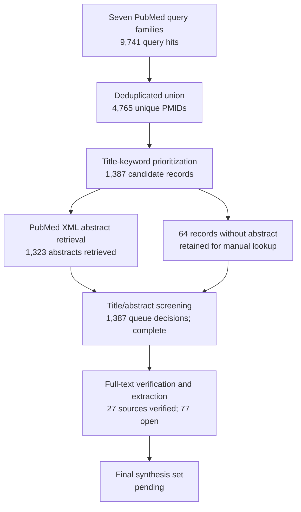

# Review-flow record

This is a living scoping-review flow record, not a completed PRISMA diagram. Counts are frozen from the 2026-09-01 PubMed retrieval and can change when the search is rerun.

## Interpretation of counts

| Stage | Count | Evidence file | Status |
|---|---:|---|---|
| Query-family hits, including overlap | 9,741 | `search-union-summary.json` | frozen retrieval snapshot |
| Unique PubMed IDs | 4,765 | `search-union-summary.json` | deduplicated by PMID |
| Title-priority candidates | 1,387 | `screening-summary.json` | machine-assisted triage only |
| Abstracts retrieved | 1,323 | `screening-abstract-summary.json` | retrieval complete |
| Records without abstract | 64 | `screening-abstract-summary.json` | manual full-record lookup required |
| Queue records with title/abstract decision | 1,387 of 1,387 | `manual-screening-decisions.csv` | complete at title/abstract level |
| Full-text verification tranches | 27 of 104 sources; 34 of 123 evidence rows | `full-text-verification.csv` | fourth tranche complete; 77 sources open |
| Included after title/abstract screening | — | not yet available | open; final full-text eligibility is required |

The title-priority threshold is a reproducibility aid and must not be reported as an eligibility criterion. No record is included in the final review solely because it appears in `screening-candidates.csv` or `screening-abstracts.csv`.
